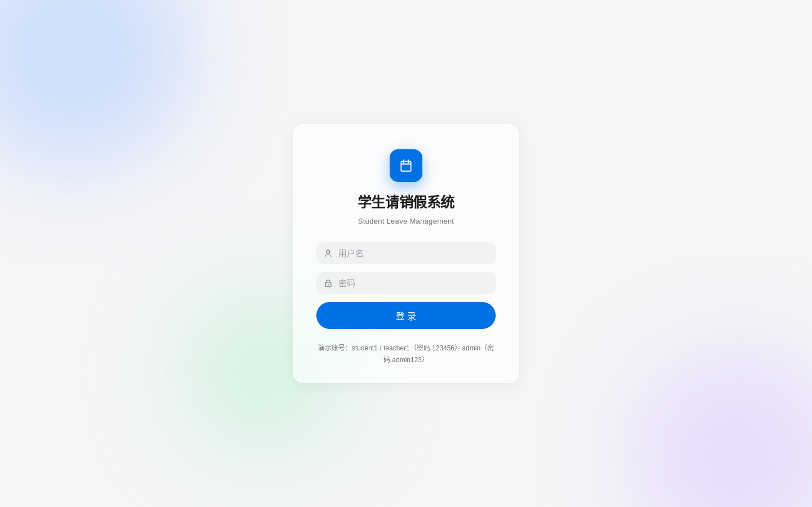
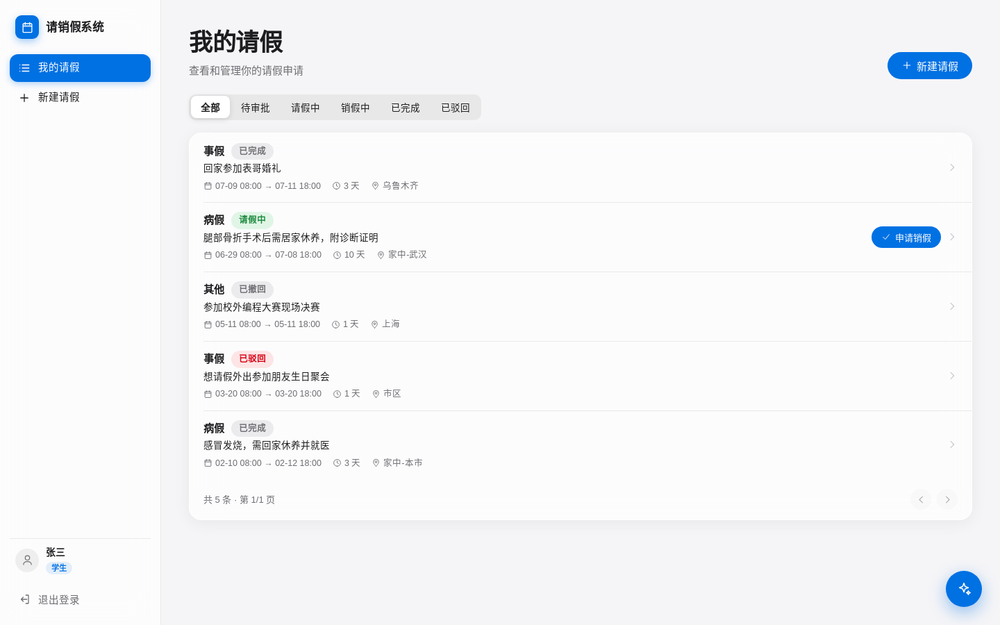
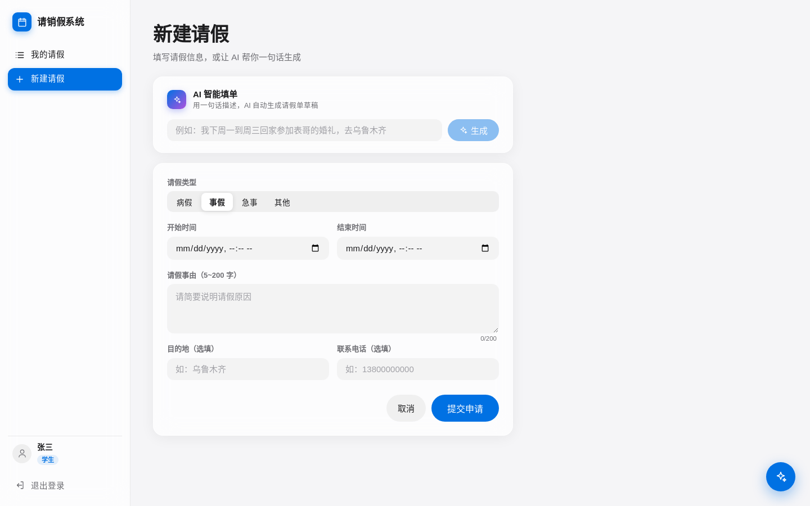
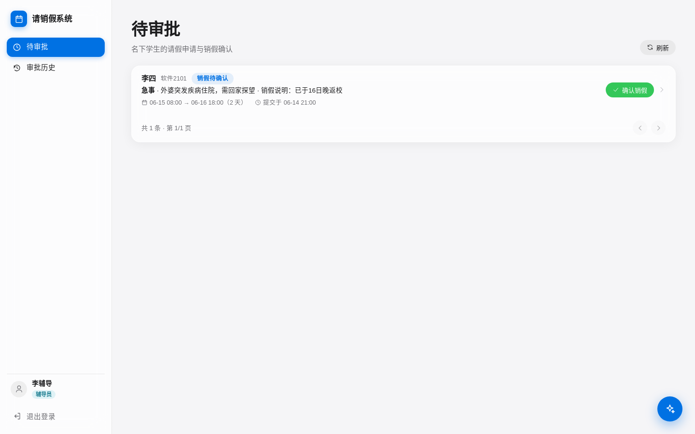
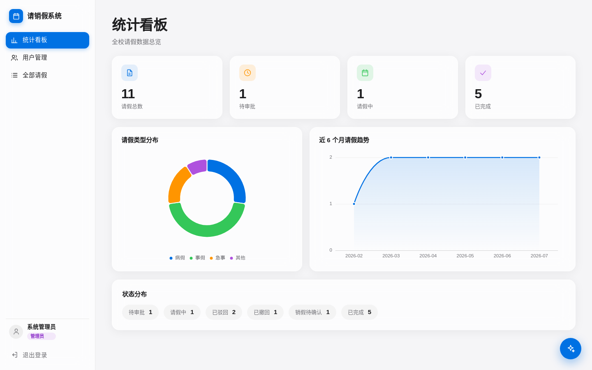
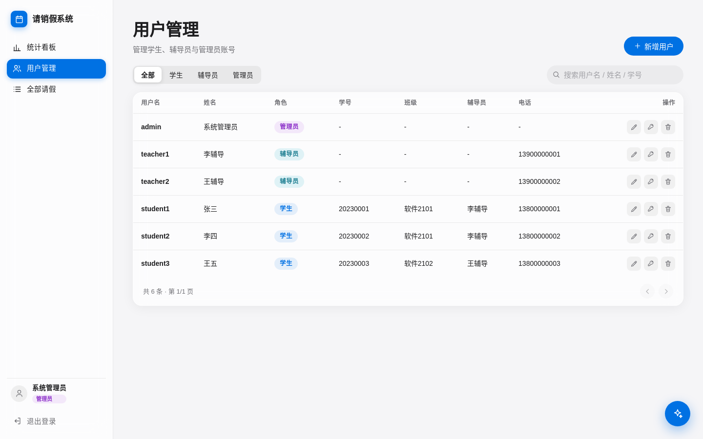
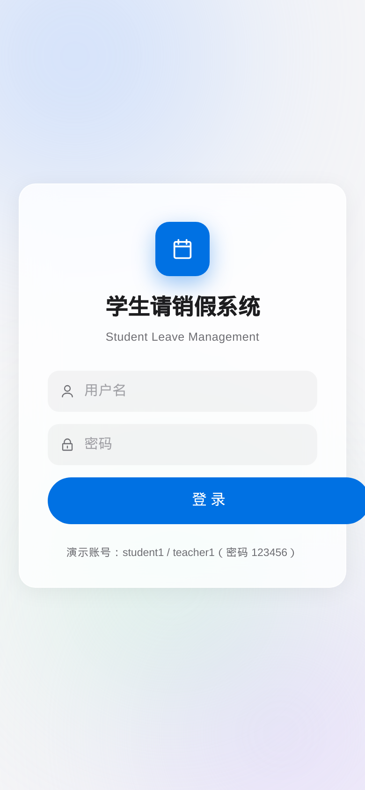
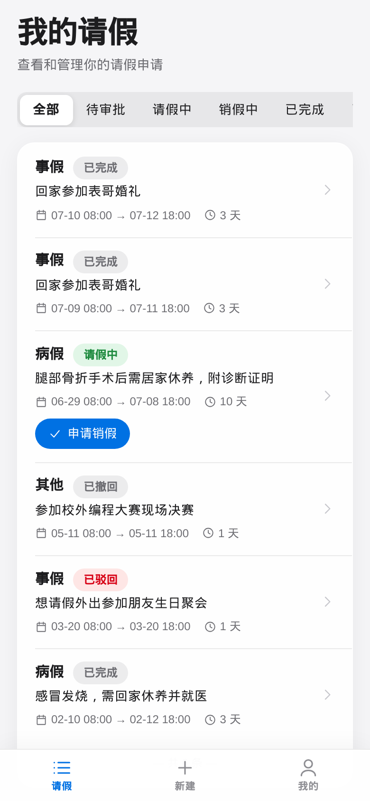
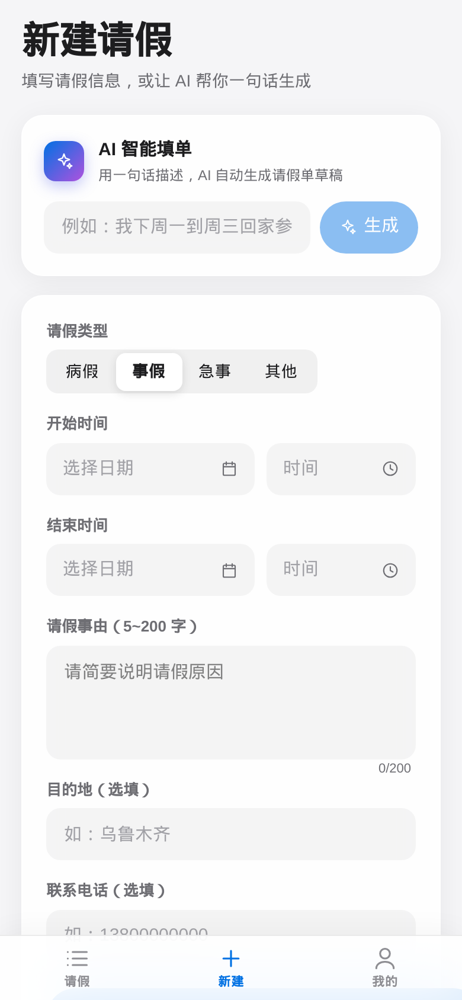
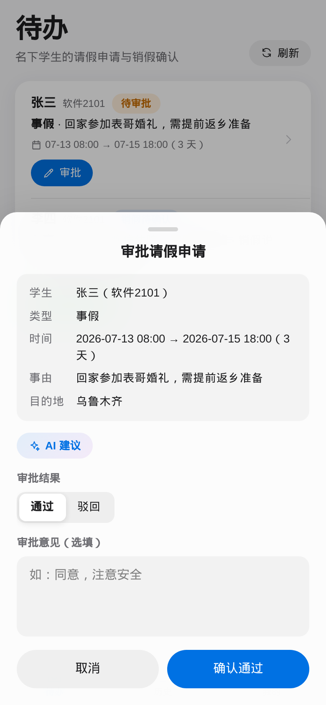

# 学生请销假系统

基于 **Spring Boot 3.4 + Spring AI + Vue 3** 的学生请销假管理系统，提供 **Web 端 + 微信小程序（uni-app）** 双前端，界面为自建 Apple HIG（Human Interface Guidelines）风格设计体系。学生/辅导员移动场景走小程序，管理员统计与用户管理走 Web 端。覆盖「学生提交请假 → 辅导员审批 → 学生返校销假 → 辅导员确认」的完整闭环，并内置三项 AI 能力（智能填单 / 审批建议 / 制度问答）。

## ✨ 特性

- **三角色权限体系**：学生（STUDENT）/ 辅导员（TEACHER）/ 管理员（ADMIN），JWT 无状态认证 + `@RequireRole` 注解式角色鉴权 + 数据范围越权校验三道防线
- **六状态请销假状态机**：`PENDING 待审批 → APPROVED 请假中 → CANCEL_PENDING 销假待确认 → COMPLETED 已完成`，支持 `REJECTED 已驳回`、`REVOKED 已撤回` 两个分支终态；所有状态流转写入 `approval_record` 审计表，详情页展示完整时间线
- **Spring AI 三能力**（双供应商：**优先 OpenAI、回退 Anthropic**，model 与 endpoint 均可环境变量自定义，兼容 DeepSeek/通义等 OpenAI 协议网关）：
  - **AI 智能填单**：学生输入一句自然语言（如"我下周一到周三回家参加表哥婚礼"），自动生成结构化请假单草稿（类型/起止时间/事由/目的地）
  - **AI 审批建议**：结合该生近半年请假次数、累计天数、驳回次数，为辅导员生成风险等级（LOW/MEDIUM/HIGH）与一句话审批建议
  - **AI 制度问答**：右下角浮窗助手，基于内置《学生请销假管理规定》回答制度问题
  - **无 Key 优雅降级**：`OPENAI_API_KEY` / `ANTHROPIC_API_KEY` 均未配置时 AI 接口统一返回 `code=5001`，前端提示但不阻断人工流程；出站请求带 5s 连接 / 60s 读超时，endpoint 不可达也不会挂起
- **Apple HIG 风格 UI**：CSS 设计令牌（Design Token）体系、毛玻璃卡片（`backdrop-filter`）、iOS 风胶囊按钮 / 状态徽章 / 分段控件、内联 SVG 图标组件（无 emoji、无第三方 UI 库）
- **管理端统计看板**：数字卡片 + ECharts 按需引入（类型分布环形图、近 6 个月趋势折线图）
- **微信小程序端（uni-app Vue3）**：学生请假、辅导员审批、AI 能力全覆盖；**微信一键登录**（wx.login → jscode2session → openid，首次账号绑定后免密）+ 账号密码双通道，未配置微信凭据时自动隐藏微信入口
- **辅导员数据隔离**：每个学生绑定一名辅导员（`sys_user.teacher_id`），辅导员只能看到/处理自己名下学生的请假单

## 🖥 界面预览

| 登录 | 学生·我的请假 | 学生·AI 智能填单 |
|---|---|---|
|  |  |  |

| 辅导员·待审批 | 管理员·统计看板 | 管理员·用户管理 |
|---|---|---|
|  |  |  |

**微信小程序端**

| 登录（微信/账号双通道） | 学生·我的请假 | 学生·新建+AI 填单 | 辅导员·待办 |
|---|---|---|---|
|  |  |  |  |

## 🧰 技术栈

### 后端（`backend/`）

| 依赖 | 版本 | 用途 |
|---|---|---|
| Spring Boot (spring-boot-starter-web) | 3.4.7 | Web 框架，Java 17 |
| MyBatis-Plus (mybatis-plus-spring-boot3-starter) | 3.5.9 | ORM、条件构造器、分页 |
| mybatis-plus-jsqlparser | 3.5.9 | 3.5.9+ 分页插件所需 SQL 解析器 |
| Spring AI (spring-ai-starter-model-openai / -anthropic) | 1.0.0 | ChatClient 双供应商接入（OpenAI 优先，Anthropic 回退） |
| jjwt (api / impl / jackson) | 0.12.6 | JWT 签发与校验 |
| spring-security-crypto | 随 Boot 3.4.7 管理 | 仅用 BCrypt 密码哈希，不引入完整 Spring Security |
| mysql-connector-j | 随 Boot 3.4.7 管理 | MySQL 8 驱动 |
| Lombok | 随 Boot 3.4.7 管理 | 简化样板代码 |

### 前端（`frontend/`）

| 依赖 | 版本 | 用途 |
|---|---|---|
| Vue | ^3.5.13 | 组合式 API |
| Vue Router | ^4.5.0 | Hash 路由 + 角色路由守卫 |
| Pinia | ^2.3.0 | 登录态状态管理 |
| Axios | ^1.7.9 | HTTP 请求 + 统一拦截器 |
| ECharts | ^5.6.0 | 统计看板图表（按需引入） |
| Vite | ^6.0.7 | 开发服务器与构建 |
| @vitejs/plugin-vue | ^5.2.1 | Vue SFC 支持 |

### 微信小程序（`miniprogram/`）

| 依赖 | 用途 |
|---|---|
| uni-app (Vue3 + Vite) | 一套代码编译 `mp-weixin`（微信开发者工具）与 `h5`（本机预览验证） |
| 自绘组件 | AppIcon（SVG data-url，无 emoji）/ StatusPill / SegmentedBar / TabBar（Apple 风底部导航）/ SheetModal（iOS 底部面板） |

## 🚀 快速启动

### 环境要求

- Java 17+、Maven 3.6+
- Node.js 20+、npm
- MySQL 8

### 1. 初始化数据库

`docs/schema.sql` 包含建库建表语句和种子数据（3 个角色 6 个账号 + 覆盖全部状态的 10 条请假单）。

```bash
# 以 root 导入（脚本内含 CREATE DATABASE leave_sys）
mysql -u root -p < docs/schema.sql
```

后端默认使用应用账号 `leave_app / leave123` 连接（见 `backend/src/main/resources/application.yml`），需先建号授权：

```sql
CREATE USER IF NOT EXISTS 'leave_app'@'localhost' IDENTIFIED BY 'leave123';
GRANT ALL PRIVILEGES ON leave_sys.* TO 'leave_app'@'localhost';
FLUSH PRIVILEGES;
```

> 也可直接改 `application.yml` 里的 `spring.datasource.username/password` 用自己的账号。

### 2. 启动后端（端口 8080，上下文 `/api`）

```bash
cd backend

# 可选：配置 AI 供应商以启用 AI 能力（不配置也能正常运行，AI 接口降级返回 code=5001）
# 供应商优先级：默认 auto = 优先 OpenAI，未配 OpenAI Key 再回退 Anthropic

# 方式一：OpenAI（或任意 OpenAI 兼容网关：DeepSeek / 通义 / one-api 等）
export OPENAI_API_KEY=sk-xxx
export OPENAI_BASE_URL=https://api.deepseek.com   # 可选，默认 https://api.openai.com
export OPENAI_MODEL=deepseek-chat                 # 可选，默认 gpt-4o

# 方式二：Anthropic
export ANTHROPIC_API_KEY=sk-ant-xxx
export ANTHROPIC_BASE_URL=https://api.anthropic.com  # 可选
export ANTHROPIC_MODEL=claude-opus-4-8               # 可选

# 可选：强制指定供应商
export AI_PROVIDER=auto   # auto | openai | anthropic

mvn spring-boot:run
# 或打包运行
mvn -DskipTests package && java -jar target/leave-backend-1.0.0.jar
```

### 3. 启动前端（端口 5173，`/api` 代理到 8080）

```bash
cd frontend
npm install
npm run dev
```

浏览器访问 <http://localhost:5173>。

### 4. 微信小程序（可选）

**方式 A（免构建，推荐）**：仓库已内置编译产物，克隆后直接用微信开发者工具**导入 `miniprogram/dist/build/mp-weixin` 目录**（注意：不是 `miniprogram/` 源码目录，导错会报"未找到 app.json"）。

**方式 B（自行构建/二次开发）**：

```bash
cd miniprogram
npm install
npm run build:mp-weixin      # 产出 dist/build/mp-weixin
# 或开发模式（watch）：npm run dev:mp-weixin → dist/dev/mp-weixin
```

用**微信开发者工具**导入 `miniprogram/dist/build/mp-weixin`（manifest 已配 appid，也可换成自己的），
详情设置勾选「不校验合法域名/HTTPS 证书」（后端为 http://localhost:8080）；真机预览把
`src/utils/request.js` 的 BASE_URL 改为局域网 IP 或正式域名。

微信一键登录需后端配置小程序凭据（不配则小程序自动只显示账号密码登录）：

```bash
export WX_APPID=wx****************
export WX_SECRET=********************************   # 仅后端环境变量，绝不进前端代码/仓库
```

无微信开发者工具时可用 H5 预览界面效果：`npm run dev:h5`。

### 5. 演示账号

| 账号 | 密码 | 角色 |
|---|---|---|
| admin | admin123 | 管理员 |
| teacher1 | 123456 | 辅导员（李辅导） |
| teacher2 | 123456 | 辅导员（王辅导） |
| student1 | 123456 | 学生（张三，teacher1 名下） |
| student2 | 123456 | 学生（李四，teacher1 名下） |
| student3 | 123456 | 学生（王五，teacher2 名下） |

### 6. 冒烟测试（24 项断言）

后端启动后执行：

```bash
bash backend/smoke-test.sh
```

覆盖三角色登录、请假提交/审批/销假全流程、参数校验（4001）、状态机约束（4009）、越权拦截（401/403）、AI 接口降级（5001）等 24 项断言，全部 PASS 即环境正常。

## 📁 目录结构

```
leave-system
├── backend/                          # Spring Boot 3.4 后端
│   ├── pom.xml
│   ├── smoke-test.sh                 # 冒烟测试脚本（24 项）
│   └── src/main/
│       ├── java/com/school/leave/
│       │   ├── LeaveApplication.java
│       │   ├── auth/                 # 登录、JWT 签发/解析、用户上下文
│       │   ├── config/               # 认证拦截器、@RequireRole、MP 分页、CORS、Jackson
│       │   ├── common/               # Result 统一响应、业务异常、全局异常处理、枚举
│       │   ├── user/                 # 用户实体与 Mapper
│       │   ├── leave/                # 请假单：学生提交/撤回/销假 + 辅导员审批
│       │   ├── admin/                # 管理端：用户 CRUD / 全部请假单 / 统计
│       │   └── ai/                   # Spring AI 三能力
│       └── resources/application.yml
├── frontend/                         # Vue 3 + Vite 前端
│   ├── vite.config.js                # 5173 端口，/api 代理 8080
│   └── src/
│       ├── api/                      # axios 实例（拦截器）+ 接口封装
│       ├── router/                   # 路由 + 角色守卫
│       ├── stores/                   # Pinia 登录态
│       ├── layout/                   # 侧边栏布局（毛玻璃）
│       ├── components/               # Icon/Modal/Segmented/StatusPill/Pagination/AiAssistant 等
│       ├── views/                    # student / teacher / admin 三端页面
│       ├── styles/main.css           # Apple HIG 设计令牌体系
│       └── utils/                    # 枚举映射、toast
├── miniprogram/                      # 微信小程序（uni-app Vue3 + Vite）
│   └── src/
│       ├── manifest.json             # mp-weixin appid（无 Secret）
│       ├── pages.json                # 9 页注册
│       ├── utils/request.js          # uni.request 封装（token/401/5001/4010）
│       ├── api/                      # 契约接口封装（含微信登录三接口）
│       ├── components/               # AppIcon/StatusPill/SegmentedBar/TabBar/SheetModal
│       └── pages/                    # 登录/微信绑定/学生端/辅导员端/AI 问答/我的
└── docs/
    ├── 方案设计.md
    ├── 接口文档.md
    ├── schema.sql                    # 建库建表 + 种子数据
    ├── screenshots/                  # 系统截图
    └── modules/                      # 模块建设文档（见下）
```

## 📚 文档索引

- [接口文档](docs/接口文档.md) — 全部 REST 接口、错误码、枚举定义
- [方案设计](docs/方案设计.md) — 技术选型、状态机、UI 设计规范
- 模块建设文档：
  1. [认证权限与请假核心模块](docs/modules/01-认证权限与请假核心模块.md) — JWT 认证、三道鉴权防线、六状态状态机、请假主流程
  2. [审批管理与用户管理模块](docs/modules/02-审批管理与用户管理模块.md) — 审批流转与审计设计、辅导员数据隔离、用户管理、Apple HIG 前端体系
  3. [AI 智能助手与统计分析模块](docs/modules/03-AI智能助手与统计分析模块.md) — Spring AI 调用链、提示词工程、降级设计、ECharts 统计看板

## 📄 License

[MIT](LICENSE) © 2026 lonelymeko
