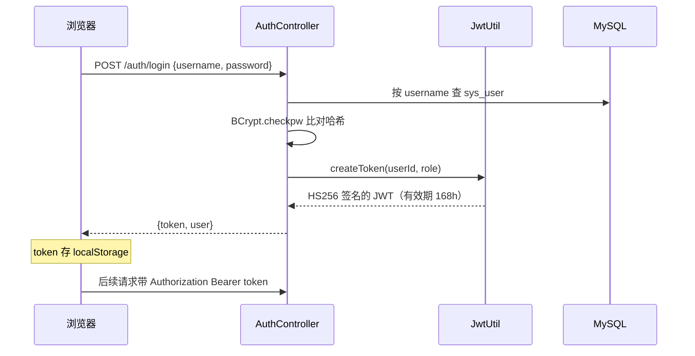
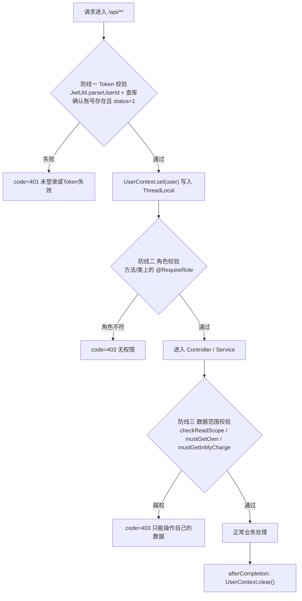
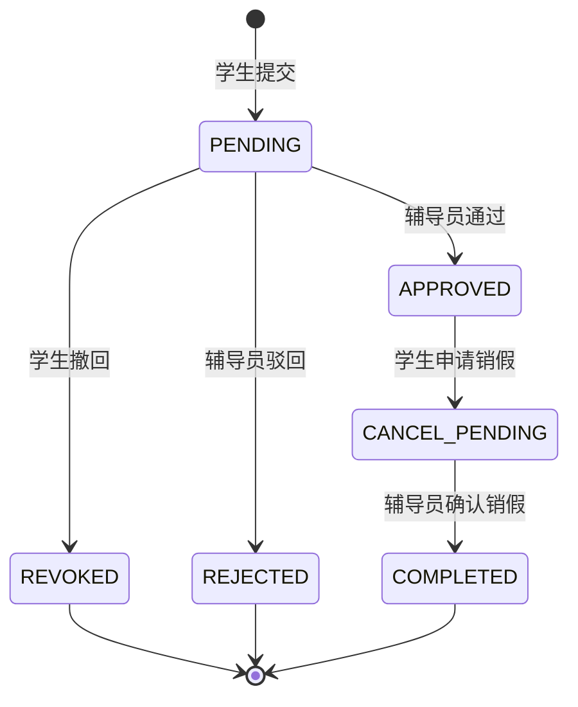
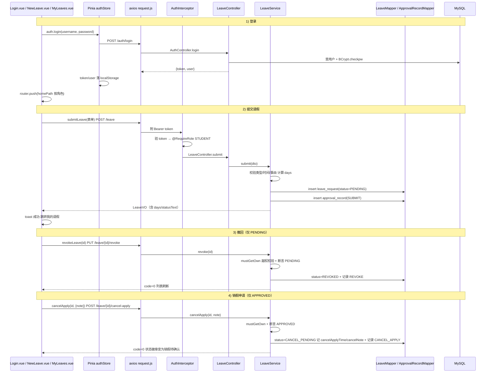
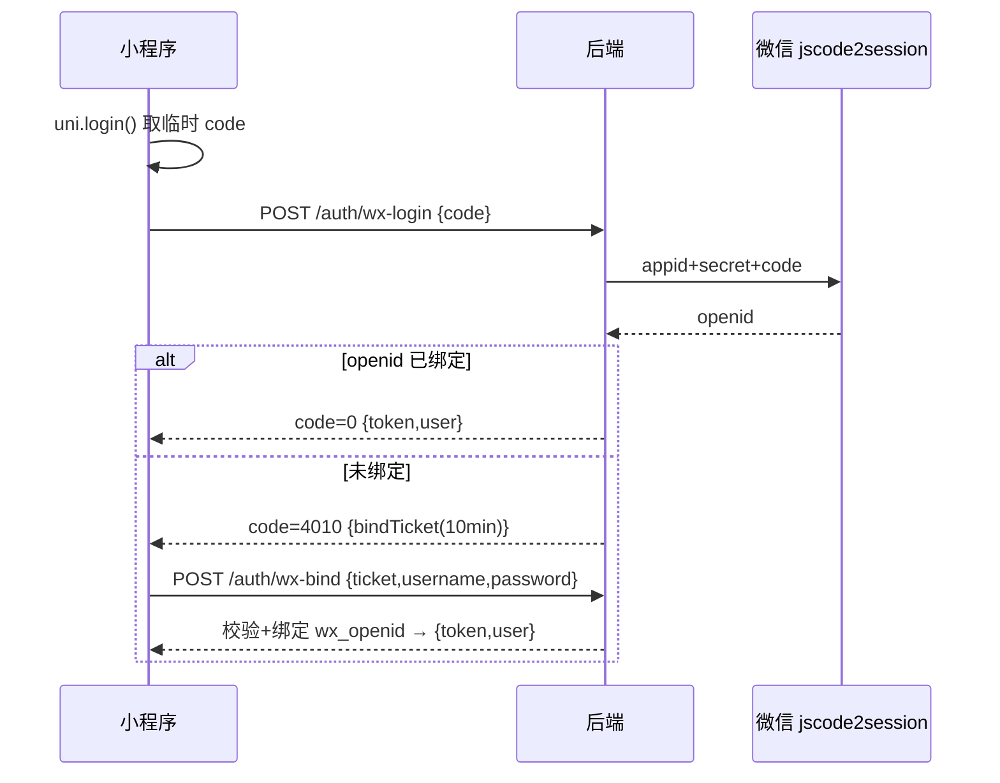

# 模块一：认证权限与请假核心模块

## 1. 模块职责

本模块是系统的安全底座与核心业务载体：一方面提供三角色（STUDENT / TEACHER / ADMIN）统一的登录认证与权限控制，保证"谁能进系统、能调哪些接口、能看哪些数据"三个层面都受控；另一方面实现学生侧的请销假核心链路——从提交请假单、查看列表与详情时间线，到待审批期间撤回、获批返校后申请销假，并以六状态状态机严格约束每一次流转。

功能清单：

- 用户名密码登录（BCrypt 校验），签发 JWT；`GET /auth/me` 回显当前用户
- JWT 认证拦截器 + `@RequireRole` 注解式角色鉴权 + 数据范围越权校验
- 学生提交请假单（`POST /leave`），后端计算自然天数 `days` 并做参数校验
- 我的请假分页查询（`GET /leave/my`，支持状态筛选）
- 请假单详情 + 审批时间线（`GET /leave/{id}`，三角色分级可见）
- 撤回申请（`PUT /leave/{id}/revoke`，仅 PENDING）
- 申请销假（`POST /leave/{id}/cancel-apply`，仅 APPROVED）
- 统一响应体 `Result<T>`、业务异常 `BizException`、全局异常处理

## 2. 用到的依赖及作用

| 依赖 | 版本 | 在本模块中的作用 |
|---|---|---|
| spring-boot-starter-web | 3.4.7 | RestController、HandlerInterceptor、全局异常处理 |
| jjwt-api / jjwt-impl / jjwt-jackson | 0.12.6 | JWT 的构建（`Jwts.builder()`）、HMAC-SHA 签名与解析校验 |
| spring-security-crypto | 随 Boot 3.4.7 管理 | 仅使用其中的 `BCrypt` 类做密码哈希与比对，不引入完整 Spring Security 过滤器链 |
| mybatis-plus-spring-boot3-starter | 3.5.9 | `BaseMapper` 通用 CRUD、`QueryWrapper` 条件查询、注解 SQL 分页 |
| mybatis-plus-jsqlparser | 3.5.9 | 分页插件 `PaginationInnerInterceptor` 在 MP 3.5.9+ 的必需依赖 |
| Lombok | 随 Boot 管理 | `@Data` / `@RequiredArgsConstructor` 等 |
| vue-router | ^4.5.0 | 前端路由与 `beforeEach` 角色守卫（未登录跳登录页、角色不符跳各自首页） |
| pinia | ^2.3.0 | `useAuthStore` 持有 token/user，落 localStorage 实现刷新不掉线 |
| axios | ^1.7.9 | 请求拦截器自动附加 `Authorization: Bearer <token>`，响应拦截器统一处理 code |

## 3. 核心原理

### 3.1 JWT 无状态认证

登录成功后由 `JwtUtil.createToken()` 签发 JWT：`subject` 存用户 id，附加 `role` claim，`issuedAt` / `expiration` 控制有效期（`jwt.expire-hours` 配置，默认 168 小时），使用 `Keys.hmacShaKeyFor(secret)` 生成的 HMAC 密钥签名（jjwt 0.12 API）。服务端不保存任何会话——每次请求由 `JwtUtil.parseUserId()` 用同一密钥 `verifyWith(key)` 验签并解析出用户 id，签名不符、格式错误或已过期都会在 `parseSignedClaims` 抛异常，统一返回 `null`，拦截器随即回 401。

### 3.2 拦截器鉴权链路——三道防线

`WebConfig` 将 `AuthInterceptor` 注册到 `/**`（仅放行 `/auth/login` 与 `/error`）。一次请求要依次通过三道防线：

- **防线一（认证）**：解析 Bearer Token 拿到 userId 后**再查一次库**，既能拿到最新角色，又保证被管理员禁用（`status=0`）的账号即使持有效 token 也立刻失效。
- **防线二（角色）**：`@RequireRole` 是自定义注解，拦截器先取方法级再取类级注解，用户角色不在允许列表即 403。如 `LeaveController.submit` 标注 `@RequireRole("STUDENT")`，`ApprovalController` 整类标注 `@RequireRole("TEACHER")`。
- **防线三（数据范围）**：角色对了也不代表能操作任意一条数据。`LeaveService.mustGetOwn()` 保证学生只能操作自己的单；`checkReadScope()` 保证详情页学生只看自己、辅导员只看名下学生（比对 `sys_user.teacher_id`）、管理员全量；辅导员写操作走 `mustGetInMyCharge()`。

通过校验的用户对象放入 `UserContext`（ThreadLocal），业务代码随处可用 `UserContext.id()` 取当前用户，`afterCompletion` 中清理防止线程复用串号。

被拦截时统一返回 HTTP 200 + 业务 code（401/403），与全局异常处理器的返回结构一致，前端只需在 axios 响应拦截器里看 `body.code` 一处分支。

### 3.3 BCrypt 加盐哈希

密码用 `BCrypt.hashpw(password, BCrypt.gensalt(10))` 存储：每次生成随机盐、cost factor 10（2^10 轮），盐内嵌在哈希串中，因此相同密码每次哈希结果都不同，可抵御彩虹表；校验用 `BCrypt.checkpw()` 从哈希串还原盐重算比对。库表 `sys_user.password` 只存哈希，实体 `SysUser.password` 标注 `@JsonIgnore` 防止序列化泄露。

### 3.4 请销假六状态状态机

状态字段为 `leave_request.status`，所有流转在 `LeaveService` 中以"前置状态断言 + 更新 + 写审计记录"三步在同一事务（`@Transactional`）内完成，非法流转抛 `BizException.badState()`（code=4009）：

例如撤回操作先断言 `PENDING`，否则 4009——这保证了"已通过的单不能撤回、已终态的单不能再审批"等业务约束在服务端强制成立，而非只依赖前端隐藏按钮。

### 3.5 days 计算与参数校验

提交请假时服务端不信任前端传来的天数，由 `LeaveService.calcDays()` 统一计算：**按自然天算，日期差 + 1**（`ChronoUnit.DAYS.between(start.toLocalDate(), end.toLocalDate()) + 1`），存为 `DECIMAL(4,1)`。参数校验依次为：类型必须是 `LeaveType` 合法枚举、起止时间非空、`endTime` 必须晚于 `startTime`、`startTime` 不得早于今天 0 点（`LocalDate.now().atStartOfDay()`）、事由 trim 后 5~200 字，任一不满足抛 4001。

## 4. 业务完整流程（登录 → 提交请假 → 撤回 → 销假申请）

前端链路：页面组件 → `src/api/index.js` 封装函数 → `src/api/request.js` axios 实例（请求拦截器附 token，响应拦截器 code=0 时直接返回 `data`）→ 后端 Controller → Service 校验 → Mapper → MySQL → 响应 → 组件渲染。

几个前后端协作细节：

- 前端 `datetime-local` 控件值（`2026-07-13T08:00`）经 `toApiTime()` 转成接口格式 `2026-07-13 08:00:00`，后端 `JacksonConfig` 全局注册 `yyyy-MM-dd HH:mm:ss` 的 LocalDateTime 序列化器与之对齐。
- 路由守卫（`router/index.js` 的 `beforeEach`）按 `meta.roles` 与 `authStore.role` 拦截，未登录一律回 `/login`，登录后按角色落到各自首页（`homePath` getter）。
- axios 响应拦截器发现 `code=401` 时清理本地登录态并跳登录页，与后端 token 过期机制闭环。

## 5. 关键代码索引

| 功能点 | 文件路径 | 说明 |
|---|---|---|
| 登录 / me | `backend/src/main/java/com/school/leave/auth/AuthController.java` | BCrypt 校验、禁用账号拦截、签发 token |
| JWT 签发与解析 | `backend/src/main/java/com/school/leave/auth/JwtUtil.java` | jjwt 0.12 API，HMAC 密钥，失败返回 null |
| 当前用户上下文 | `backend/src/main/java/com/school/leave/auth/UserContext.java` | ThreadLocal 存取，拦截器负责 set/clear |
| 认证鉴权拦截器 | `backend/src/main/java/com/school/leave/config/AuthInterceptor.java` | 防线一 + 防线二，统一 JSON 拒绝响应 |
| 角色注解 | `backend/src/main/java/com/school/leave/config/RequireRole.java` | 可标注在类或方法 |
| 拦截器/CORS 注册 | `backend/src/main/java/com/school/leave/config/WebConfig.java` | 放行 `/auth/login`、`/error` |
| 请假接口 | `backend/src/main/java/com/school/leave/leave/LeaveController.java` | 提交/我的/详情/撤回/销假申请 |
| 状态机与校验 | `backend/src/main/java/com/school/leave/leave/LeaveService.java` | `submit/revoke/cancelApply/calcDays/checkReadScope/mustGetOwn` |
| 联表查询 SQL | `backend/src/main/java/com/school/leave/leave/LeaveMapper.java` | `SELECT_VO` 联 `sys_user` 出姓名，注解式动态 SQL 分页 |
| 状态/类型/动作枚举 | `backend/src/main/java/com/school/leave/common/enums/` | `LeaveStatus` / `LeaveType` / `ApprovalAction` 及中文文案 |
| 统一响应 / 业务异常 | `backend/src/main/java/com/school/leave/common/` | `Result` / `BizException` / `GlobalExceptionHandler` / `PageVO` |
| axios 实例与拦截器 | `frontend/src/api/request.js` | 附 token、code 分发、401 跳登录、5001 静默 |
| 登录态 store | `frontend/src/stores/auth.js` | token/user 持久化、`homePath` 按角色 |
| 路由与守卫 | `frontend/src/router/index.js` | `meta.roles` 角色路由控制 |
| 学生端页面 | `frontend/src/views/student/`（`MyLeaves.vue` / `NewLeave.vue` / `LeaveDetail.vue`） | 列表筛选、提交表单、详情时间线 |

### 补充：微信小程序一键登录（双通道）

小程序端支持微信一键登录，与账号密码登录并存：

- `sys_user.wx_openid` 唯一索引；openid **不明文下发**，未绑定时只发 10 分钟有效的 `bindTicket`（JWT，claim `purpose=wx-bind`）。
- 绑定互斥校验：账号已绑其他微信 / 微信已绑其他账号 → `4009`。
- `GET /auth/wx-enabled` 探测：后端未配 `WX_APPID`/`WX_SECRET` 环境变量时返回 false，小程序自动隐藏微信按钮，账号密码登录兜底；`AppSecret` 只存在于后端环境变量。
- 微信侧调用失败/未启用 → `5002`。

## 6. 错误码与边界

| code | 触发场景（本模块） |
|---|---|
| 401 | 无 `Authorization` 头 / token 验签失败或过期 / 账号已被禁用（status=0） |
| 403 | 学生访问他人请假单详情或操作他人单据；角色与 `@RequireRole` 不符（如学生调辅导员接口） |
| 4001 | 用户名或密码为空/错误；请假类型非法；起止时间缺失或 `endTime<=startTime`；开始时间早于今天 0 点；事由不足 5 字或超 200 字 |
| 4004 | 请假单 id 不存在 |
| 4009 | 非 PENDING 状态撤回；非 APPROVED 状态申请销假 |

边界说明：登录接口对"用户不存在"与"密码错误"返回同一提示（4001"用户名或密码错误"），避免账号枚举；拦截器对被禁用账号返回 401 而非 403，使前端统一走"清登录态回登录页"逻辑；`LeaveVO.studentId` 标注 `@JsonIgnore`，仅用于服务端越权比对，不出现在响应中。
