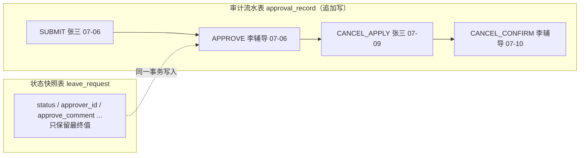
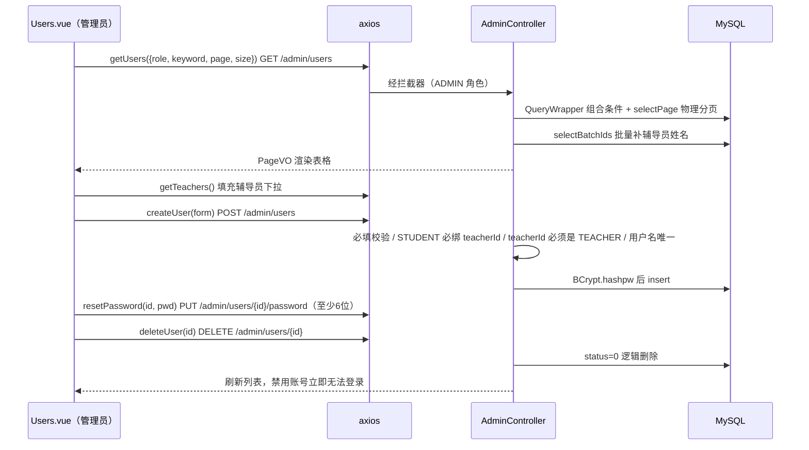

# 模块二：审批管理与用户管理模块

## 1. 模块职责

本模块承担请销假流程的"处理侧"与系统的"管理侧"：辅导员在待办列表中对名下学生的请假单执行通过/驳回、对返校学生执行销假确认，每一次动作都落入审计表形成可回溯的时间线；管理员则拥有用户全生命周期管理（新增/编辑/重置密码/逻辑删除）与全量请假单查询能力。同时本模块沉淀了前端 Apple HIG 设计令牌体系与一组可复用基础组件，三端页面共享同一套视觉语言。

功能清单：

- 辅导员待办列表（`GET /approval/pending`：PENDING + CANCEL_PENDING，PENDING 排前）
- 审批通过/驳回（`POST /approval/{leaveId}`，驳回必填意见）
- 销假确认（`POST /approval/{leaveId}/cancel-confirm`，CANCEL_PENDING → COMPLETED）
- 审批历史（`GET /approval/history`，按我处理过的单倒序）
- 用户分页查询（角色筛选 + username/realName/studentNo 关键字模糊）
- 用户新增/编辑/重置密码/逻辑删除、辅导员下拉（`GET /admin/teachers`）
- 管理端全部请假单查询（`GET /admin/leaves`，状态 + 关键字筛选）
- 前端设计令牌体系（`styles/main.css`）与基础组件库（Icon/Modal/Segmented/StatusPill/Pagination 等）

## 2. 用到的依赖及作用

| 依赖 | 版本 | 在本模块中的作用 |
|---|---|---|
| spring-boot-starter-web | 3.4.7 | `ApprovalController` / `AdminController` REST 接口 |
| mybatis-plus-spring-boot3-starter | 3.5.9 | `QueryWrapper` 动态条件（角色/关键字筛选）、`selectPage` 物理分页、`BaseMapper` CRUD |
| mybatis-plus-jsqlparser | 3.5.9 | `PaginationInnerInterceptor` 解析改写 SQL 所依赖的 JSqlParser |
| spring-security-crypto | 随 Boot 3.4.7 管理 | 管理员新增用户/重置密码时 `BCrypt.hashpw(pwd, gensalt(10))` |
| Lombok | 随 Boot 管理 | DTO / 实体样板代码 |
| vue | ^3.5.13 | 组合式 API 页面（Pending/History/Users/AllLeaves） |
| vue-router | ^4.5.0 | 辅导员/管理员路由与 `meta.roles` 守卫 |
| pinia | ^2.3.0 | 布局侧边栏按 `auth.role` 渲染菜单 |
| axios | ^1.7.9 | 审批/用户管理接口封装（`src/api/index.js`） |

## 3. 核心原理

### 3.1 审批流转与审计记录：为何单独设计 `approval_record` 表

`leave_request` 表本身有 `status / approver_id / approve_comment / approve_time` 等字段，看似足以记录审批结果，但它只能保存**最终快照**——字段会被覆盖，无法回答"这张单经历过什么"。因此设计独立的 `approval_record` 审计表（`leave_id / operator_id / action / comment / create_time`），把 `SUBMIT / APPROVE / REJECT / REVOKE / CANCEL_APPLY / CANCEL_CONFIRM` 六种动作以**追加写**（append-only）的方式记录：

- **完整时间线**：详情页 `GET /leave/{id}` 用 `LeaveMapper.findRecords()` 联 `sys_user` 查出操作人姓名，按 `create_time, id` 升序渲染成时间线，一张经历完整生命周期的单会有 SUBMIT→APPROVE→CANCEL_APPLY→CANCEL_CONFIRM 四条记录。
- **不可抵赖**：审计记录只插入不更新，谁在何时做了什么、写了什么意见都有据可查。
- **与状态更新同事务**：`LeaveService.approve()` / `cancelConfirm()` 标注 `@Transactional`，"改状态 + 写审计"要么都成功要么都回滚，不会出现状态变了却缺审计的脏数据。



### 3.2 辅导员数据范围隔离（teacher_id）

学生与辅导员是多对一关系：`sys_user.teacher_id` 指向学生所属辅导员。隔离在**读、写两侧**同时收口：

- **读侧**：`LeaveMapper.pagePending()` 的 SQL 直接带 `WHERE s.teacher_id = #{tid}`，辅导员从数据库层面就查不到别人名下学生的单；待办排序用 `ORDER BY FIELD(lr.status,'PENDING','CANCEL_PENDING')` 让新申请始终排在销假确认前。审批历史则按 `approver_id = 自己` 过滤。
- **写侧**：所有写操作（审批、销假确认、AI 审批建议取单）进入业务前先过 `LeaveService.mustGetInMyCharge(leaveId)`——查出单据对应学生，比对 `student.teacherId` 与当前登录辅导员 id，不匹配抛 403。即使攻击者猜到别人学生的 leaveId 直接调接口也会被拒。

### 3.3 MyBatis-Plus 分页插件原理

`MybatisPlusConfig` 注册 `MybatisPlusInterceptor` 并加入 `PaginationInnerInterceptor(DbType.MYSQL)`。其原理是 MyBatis 插件机制（拦截 `Executor.query`）：当 Mapper 方法参数中出现 `IPage` 对象时，插件先把原 SQL 改写成 `SELECT COUNT(*)` 查询总数回填 `total`，再按 MySQL 方言在原 SQL 末尾拼接 `LIMIT offset, size` 做**物理分页**——而不是把全表查回内存再截取。注意 MP 3.5.9 起 JSqlParser 被拆为独立坐标，必须额外引入 `mybatis-plus-jsqlparser`，否则分页插件启动即报错。本模块两类分页都走它：`AdminController.users()` 用 `selectPage + QueryWrapper`（`role` 等值 + 关键字 `like` 的 or 组合），请假单列表用 `@Select` 注解 SQL + `IPage` 参数（联表 + `<script>` 动态条件）。分页结果统一经 `PageVO.of(page)` 转成 `{records, total, current, size}` 结构。

### 3.4 用户"逻辑删除"

删除用户不做物理 `DELETE`，而是 `AdminController.deleteUser()` 将 `sys_user.status` 置 0：

- 历史请假单、审计记录中的外键引用（`student_id / approver_id / operator_id`）依然可联表查出姓名，报表和时间线不出现"幽灵用户"；
- 登录（`AuthController`）与每次请求的拦截器（`AuthInterceptor`）都会检查 `status != 1` 并拒绝，被删用户即刻无法登录、已签发的 token 也随之失效；
- 辅导员下拉 `GET /admin/teachers` 只列 `status=1` 的在职辅导员，避免新学生绑到已停用账号。

### 3.5 前端 Apple HIG 设计令牌体系与组件复用

`frontend/src/styles/main.css` 的 `:root` 定义了全套 CSS 变量（Design Token）：品牌色 `--accent: #0071e3`、语义色 `--green/--orange/--red/--purple/--teal` 及各自 `-soft` 浅底、`--surface: rgba(255,255,255,.72)` 毛玻璃面、圆角 `--radius-lg/md/pill`、阴影 `--shadow-card/pop`、`--blur: saturate(180%) blur(20px)` 等。**所有组件与页面只引用变量、不硬编码颜色**，这带来两个直接收益：

1. **组件天然可复用**：`StatusPill.vue` 只需 `pill-green/pill-orange` 等类名即可在学生列表、辅导员待办、管理端全量列表三处保持一致的状态徽章；`Segmented.vue`（iOS 分段控件）同时服务学生端状态筛选与用户管理角色筛选；`Modal.vue`（毛玻璃弹窗 + scale/fade 动效）承载审批弹窗、销假确认、用户编辑、重置密码四种业务；`Pagination.vue`、`EmptyState.vue`、`LoadingBlock.vue` 同理。
2. **图标零依赖统一**：`Icon.vue` 内置 30 余个线性 SVG path（`stroke="currentColor"` 跟随文字颜色），按 `name` 取用，不引图标库、不用 emoji。

布局层 `AppLayout.vue` 的侧边栏用 `backdrop-filter: var(--blur)` 实现毛玻璃，菜单按 Pinia 中的角色动态渲染，选中项 accent 填充胶囊——三端共享同一布局壳，仅菜单项不同。

## 4. 业务完整流程（审批通过/驳回 → 销假确认 → 用户管理）

```mermaid
sequenceDiagram
    participant T as Pending.vue（辅导员）
    participant X as axios request.js
    participant I as AuthInterceptor
    participant AC as ApprovalController
    participant SV as LeaveService
    participant DB as MySQL

    Note over T,DB: 1) 审批通过 / 驳回
    T->>X: 进入页面 getPending() GET /approval/pending
    X->>AC: 经拦截器（TEACHER 角色）
    AC->>SV: pagePending(page, size)
    SV->>DB: WHERE s.teacher_id = 当前辅导员 且 status IN (PENDING, CANCEL_PENDING)
    SV-->>T: PageVO&lt;LeaveVO&gt; 渲染待办卡片
    T->>T: 点「审批」开 Modal 选 APPROVE/REJECT 填意见
    T->>X: approve(id, {action, comment}) POST /approval/{leaveId}
    X->>AC: ApprovalController.approve
    AC->>SV: approve(leaveId, action, comment)
    SV->>SV: 校验 action 合法 / REJECT 必填意见
    SV->>SV: mustGetInMyCharge 数据隔离 + 断言 PENDING
    SV->>DB: status=APPROVED/REJECTED 记 approver/comment/time
    SV->>DB: insert approval_record(APPROVE 或 REJECT)
    SV-->>T: 最新 LeaveVO，toast「已通过/已驳回」并刷新列表

    Note over T,DB: 2) 销假确认
    T->>X: cancelConfirm(id) POST /approval/{leaveId}/cancel-confirm
    X->>SV: cancelConfirm(leaveId)
    SV->>SV: mustGetInMyCharge + 断言 CANCEL_PENDING
    SV->>DB: status=COMPLETED 记 complete_time + 记录 CANCEL_CONFIRM
    SV-->>T: 单据完结，从待办消失
```



链路要点：待办列表把 PENDING 单渲染「通过/驳回」按钮、CANCEL_PENDING 单渲染「确认销假」按钮，按钮可见性只是体验优化——真正的状态约束在服务端断言（4009）；用户列表返回时后端把学生的 `teacherId` 批量换成 `teacherName`（一次 `selectBatchIds`，避免 N+1 查询）。

## 5. 关键代码索引

| 功能点 | 文件路径 | 说明 |
|---|---|---|
| 审批接口 | `backend/src/main/java/com/school/leave/leave/ApprovalController.java` | 待办/历史/审批/销假确认，类级 `@RequireRole("TEACHER")` |
| 审批业务与数据隔离 | `backend/src/main/java/com/school/leave/leave/LeaveService.java` | `approve` / `cancelConfirm` / `mustGetInMyCharge` / `pagePending` / `pageHistory` |
| 待办/历史 SQL | `backend/src/main/java/com/school/leave/leave/LeaveMapper.java` | `teacher_id` 过滤、`FIELD()` 排序、注解式分页 |
| 审计实体与工厂 | `backend/src/main/java/com/school/leave/leave/ApprovalRecord.java` | `ApprovalRecord.of()` 构造流水 |
| 时间线 VO | `backend/src/main/java/com/school/leave/leave/RecordVO.java` | `actionText` 由枚举翻中文 |
| 用户管理 / 全部请假单 | `backend/src/main/java/com/school/leave/admin/AdminController.java` | CRUD、重置密码、逻辑删除、辅导员下拉 |
| 分页插件配置 | `backend/src/main/java/com/school/leave/config/MybatisPlusConfig.java` | `PaginationInnerInterceptor(DbType.MYSQL)` |
| 辅导员页面 | `frontend/src/views/teacher/Pending.vue` / `History.vue` | 待办卡片、审批 Modal、销假确认 |
| 管理端页面 | `frontend/src/views/admin/Users.vue` / `AllLeaves.vue` | 用户 CRUD 弹窗、角色分段筛选、全量查询 |
| 设计令牌 | `frontend/src/styles/main.css` | `:root` CSS 变量、按钮/徽章/表单/卡片全局样式 |
| 基础组件 | `frontend/src/components/`（`Icon.vue` / `Modal.vue` / `Segmented.vue` / `StatusPill.vue` / `Pagination.vue` / `EmptyState.vue` / `LoadingBlock.vue`） | 三端复用的 UI 原子 |
| 布局壳 | `frontend/src/layout/AppLayout.vue` | 毛玻璃侧边栏、按角色渲染菜单 |

## 6. 错误码与边界

| code | 触发场景（本模块） |
|---|---|
| 401 | 未登录/Token 失效访问审批或管理接口 |
| 403 | 学生/管理员调 `/approval/**`（角色不符）；辅导员审批**非自己名下**学生的单；非 ADMIN 调 `/admin/**` |
| 4001 | `action` 不是 APPROVE/REJECT；驳回未填意见；新增用户缺 username/password/realName 或 role 非法；学生未指定 teacherId；teacherId 不是有效辅导员；用户名已存在；重置密码少于 6 位 |
| 4004 | 请假单或用户 id 不存在 |
| 4009 | 审批非 PENDING 状态的单（含重复审批已终态单据）；对非 CANCEL_PENDING 的单做销假确认 |

边界说明：驳回意见必填在服务端强校验（前端 toast 只是第一道提示）；编辑用户接口（`PUT /admin/users/{id}`）不接受密码字段，改密走独立的重置密码接口；逻辑删除后的辅导员不再出现在下拉中，但历史单据的审批人姓名仍可正常联查显示。
