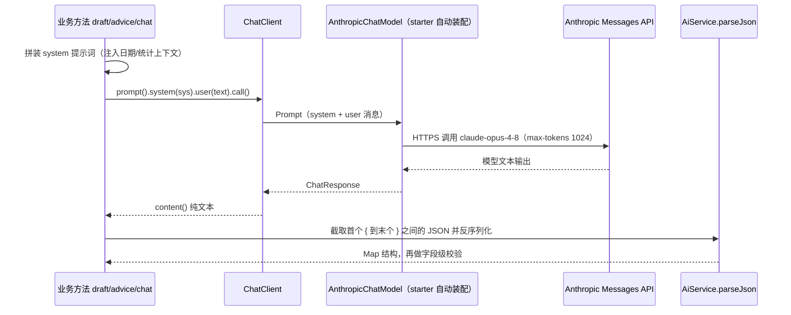
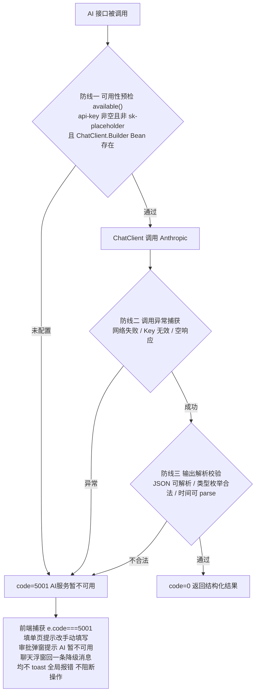
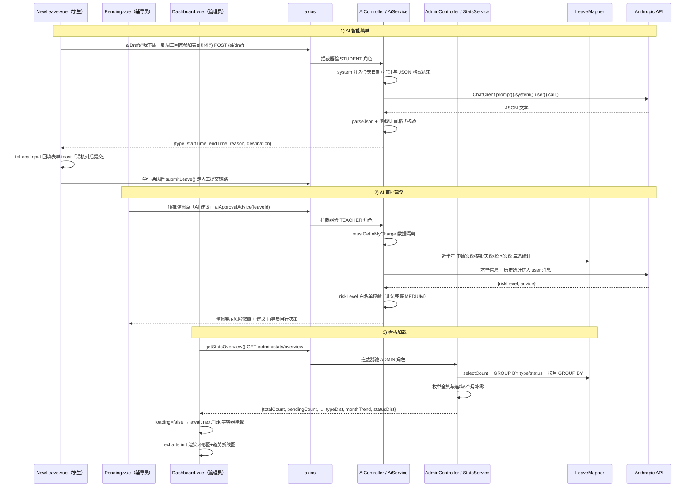

# 模块三：AI 智能助手与统计分析模块

## 1. 模块职责

本模块为系统提供智能化与数据化两块增值能力。智能化侧基于 Spring AI 的 `ChatClient` 接入 Anthropic 模型（`claude-opus-4-8`），落地三个贴合业务的 AI 能力：学生用自然语言一句话生成请假单草稿（智能填单）、辅导员审批时获取结合学生历史的风险评估与建议（审批建议）、全角色可用的请假制度问答浮窗（制度助手）；并设计了完整的**无 Key 优雅降级**机制，保证 AI 不可用时人工流程零受损。数据化侧为管理员提供统计看板：请假总量/各状态数量卡片、类型分布环形图、近 6 个月趋势折线图与状态分布，由后端 SQL 聚合 + 前端 ECharts 按需渲染。

功能清单：

- `POST /ai/draft` 智能填单（STUDENT）：自然语言 → `{type, startTime, endTime, reason, destination}` 草稿并回填表单
- `POST /ai/approval-advice` 审批建议（TEACHER）：返回 `{riskLevel: LOW|MEDIUM|HIGH, advice}`
- `POST /ai/chat` 制度问答（登录即可）：内置《学生请销假管理规定》的 system 提示词
- AI 不可用统一降级 `code=5001`，前端各调用点差异化提示、不打断操作
- `GET /admin/stats/overview` 统计聚合：数字卡片 + 类型分布 + 月度趋势 + 状态分布
- 管理端统计看板页（ECharts 环形图/面积折线图）与右下角 AI 助手浮窗组件

## 2. 用到的依赖及作用

| 依赖 | 版本 | 在本模块中的作用 |
|---|---|---|
| spring-ai-starter-model-anthropic | 1.0.0（spring-ai-bom 管理） | 自动装配 Anthropic ChatModel 与 `ChatClient.Builder`，封装 Messages API 调用 |
| spring-boot-starter-web | 3.4.7 | `AiController` / `AdminController` REST 接口 |
| mybatis-plus-spring-boot3-starter | 3.5.9 | 统计聚合与学生历史统计的注解 SQL、`selectCount` |
| Jackson（随 Boot 管理） | — | `ObjectMapper` 解析模型输出的 JSON 字符串 |
| Lombok | 随 Boot 管理 | `@Slf4j` 记录 AI 调用失败日志等 |
| echarts | ^5.6.0 | 看板图表；从 `echarts/core` 按需引入 |
| vue | ^3.5.13 | `Dashboard.vue` / `AiAssistant.vue` / `NewLeave.vue` 组合式 API |
| axios | ^1.7.9 | AI 与统计接口封装；响应拦截器对 5001 静默处理 |

## 3. 核心原理

### 3.1 Spring AI ChatClient 调用链

Spring AI 屏蔽了各家大模型 HTTP 协议差异，业务代码面向统一的 fluent API。本项目的调用链：

配置在 `application.yml`：`spring.ai.anthropic.api-key: ${ANTHROPIC_API_KEY:sk-placeholder}`（环境变量注入，占位值表示未配置），模型与 `max-tokens: 1024` 在 `chat.options` 下指定。`AiService` 注入的是 `ObjectProvider<ChatClient.Builder>` 而非直接注入 `ChatClient`——即使自动装配缺席也不会导致应用启动失败，首次真正调用时才双检锁懒加载 `builder.build()`。

由于提示词已强约束"只输出 JSON、不要 markdown 代码块"，解析端不依赖 BeanOutputConverter，而是用更宽容的手动策略：`parseJson()` 截取 `content` 中首个 `{` 到最后一个 `}` 的子串交给 Jackson——即使模型偶尔在 JSON 前后夹带客套话或围栏也能正确提取。

### 3.2 三个提示词的工程设计

三个能力共用同一个 `call(system, user)` 底座，差异全部体现在提示词工程上：

1. **智能填单（draft）——当天日期注入 + JSON Schema 约束**。大模型不知道"今天几号"，而学生描述里满是"下周一""明天"这类相对时间，因此 system 提示词由后端用 `LocalDate.now()` 动态 `formatted()` 注入今天的日期与星期（中文 `TextStyle.FULL`），并给出精确的输出格式模板（type 枚举、`yyyy-MM-dd HH:mm:ss` 时间格式）与推算规则（未指明时刻取 08:00/18:00、endTime 必须晚于 startTime）。模型返回后**后端二次校验**：`LeaveType.isValid()` 验类型、`LocalDateTime.parse()` 验两个时间格式，任一失败按 AI 不可用降级——绝不把模型的幻觉输出直接透传给表单。
2. **审批建议（approval-advice）——学生历史上下文拼装**。模型没有数据库访问能力，后端先跑三条统计 SQL（`LeaveMapper.countRecentByStudent` 近半年申请次数、`sumRecentDaysByStudent` 获批累计天数——只统计 APPROVED/CANCEL_PENDING/COMPLETED 的有效请假、`countRecentRejectedByStudent` 被驳回次数），与本单信息（学生/类型/时长/起止/事由/目的地）一起拼进 user 消息，system 约束输出 `{riskLevel, advice}` 且 advice 限 60 字。返回后对 `riskLevel` 白名单校验，非法值兜底为 `MEDIUM`。注意接口入口处先过 `mustGetInMyCharge` —— AI 能力同样遵守辅导员数据隔离。
3. **制度问答（chat）——system 内置制度**。把 8 条《学生请销假管理规定（简明版）》硬编码为 `POLICY` 常量作为 system 提示词，将模型角色限定为"制度助手"，超出制度范围建议咨询辅导员，从源头抑制自由发挥。

### 3.3 无 Key 降级的三道防线

AI 是增值能力，设计原则是**任何 AI 故障都不能阻断人工流程**。`AiService` 内置三道防线，统一收敛到 `BizException.aiUnavailable()`（code=5001）：

前端配合形成闭环：axios 响应拦截器对 5001 **不做全局 toast**，标记 `err.silent` 交由调用方各自处理——`NewLeave.vue` 提示"AI 服务暂不可用，请手动填写表单"，`Pending.vue` 审批弹窗提示后仍可人工审批，`AiAssistant.vue` 在对话流里回一条降级消息。冒烟测试（`backend/smoke-test.sh` 第 11 节）在无 Key 环境断言 5001、有 Key 环境断言 0，两种环境都可通过。

### 3.4 统计 SQL 聚合思路

`StatsService.overview()` 的思路是"数据库聚合 + 服务层补零"：

- **数字卡片**：`selectCount`（总数）+ 三次按状态 `selectCount`。
- **类型/状态分布**：`GROUP BY type` / `GROUP BY status` 一次拿到各分组 `COUNT(*)`，服务层**遍历枚举全集**回填（`getOrDefault(name, 0L)`），保证没有数据的类型/状态也以 0 出现，饼图图例与状态列表始终完整。
- **月度趋势**：`DATE_FORMAT(create_time, '%Y-%m')` 分组统计近 6 个月（`YearMonth.now().minusMonths(5)` 起），服务层从当月倒推生成连续 6 个月份序列逐一补零——折线图 x 轴不会因某月无数据而断档。

### 3.5 ECharts 按需引入与 init 时序

`Dashboard.vue` 不整包 `import * as echarts from 'echarts'`，而是从 `echarts/core` 按需注册：`PieChart`、`LineChart` 两种图 + `Tooltip/Legend/Grid` 组件 + `CanvasRenderer`，显著缩小打包体积。

**init 时序坑**：图表容器写在 `<template v-else-if="stats">` 之下，数据未返回时容器根本不在 DOM 中。若在数据一到就同步 `echarts.init(pieEl.value)`，此刻 `v-else-if` 分支尚未渲染、ref 仍是 `null`（或容器宽高为 0），初始化会失败或画出空白图。正确顺序是：`stats.value = await getStatsOverview()` → `loading.value = false`（触发分支切换）→ **`await nextTick()` 等 DOM 真正挂载** → `renderCharts()` 里再 `echarts.init`。同时监听 `window.resize` 调用 `chart.resize()` 自适应，`onBeforeUnmount` 时 `dispose()` 并解绑事件防止内存泄漏。

## 4. 业务完整流程（AI 智能填单 → AI 审批建议 → 看板加载）

三条链路的共同点：AI 输出永远只是"草稿/参考"——填单结果要学生核对后走正常提交校验，审批建议不代替辅导员点通过/驳回；统计看板则是纯只读聚合，加载失败展示 `EmptyState` 而非白屏。

## 5. 关键代码索引

| 功能点 | 文件路径 | 说明 |
|---|---|---|
| AI 三接口 | `backend/src/main/java/com/school/leave/ai/AiController.java` | draft（STUDENT）/ approval-advice（TEACHER + 数据隔离）/ chat（登录即可） |
| AI 核心服务 | `backend/src/main/java/com/school/leave/ai/AiService.java` | 提示词模板、`available()` 预检、`call()` 统一降级、`parseJson()`、`POLICY` 制度常量 |
| 学生历史统计 SQL | `backend/src/main/java/com/school/leave/leave/LeaveMapper.java` | `countRecentByStudent` / `sumRecentDaysByStudent` / `countRecentRejectedByStudent` 及看板聚合 `countByType/Status/Month` |
| 统计服务 | `backend/src/main/java/com/school/leave/admin/StatsService.java` | overview 聚合、枚举补零、连续 6 个月补零 |
| 统计接口 | `backend/src/main/java/com/school/leave/admin/AdminController.java` | `GET /admin/stats/overview` |
| AI/模型配置 | `backend/src/main/resources/application.yml` | `spring.ai.anthropic.*`：api-key 环境变量、模型 `claude-opus-4-8`、max-tokens 1024 |
| 5001 异常定义 | `backend/src/main/java/com/school/leave/common/BizException.java` | `aiUnavailable()` 工厂方法 |
| 智能填单前端 | `frontend/src/views/student/NewLeave.vue` | `runAiDraft` 回填表单、5001 降级提示 |
| 审批建议前端 | `frontend/src/views/teacher/Pending.vue` | 审批弹窗 `loadAdvice`、`RISK_MAP` 风险徽章 |
| AI 助手浮窗 | `frontend/src/components/AiAssistant.vue` | 右下角 FAB + 对话流、降级消息 |
| 统计看板 | `frontend/src/views/admin/Dashboard.vue` | ECharts 按需引入、`nextTick` 后 init、resize/dispose 生命周期 |
| 5001 静默处理 | `frontend/src/api/request.js` | 响应拦截器对 5001 不全局 toast、标记 silent |

## 6. 错误码与边界

| code | 触发场景（本模块） |
|---|---|
| 401 | 未登录调任何 AI / 统计接口 |
| 403 | 非 STUDENT 调 `/ai/draft`；非 TEACHER 调 `/ai/approval-advice`；辅导员对非名下学生的单请求建议；非 ADMIN 调 `/admin/stats/overview` |
| 4001 | `text` / `message` 为空；`leaveId` 为空 |
| 4004 | 审批建议的 `leaveId` 不存在 |
| 5001 | 未配置 `ANTHROPIC_API_KEY`（或仍为占位值 `sk-placeholder`）；模型调用网络/鉴权异常或返回空内容；模型输出无法解析为合法 JSON、类型/时间字段校验失败 |

边界说明：5001 属于"预期内的降级"而非错误——前端不弹全局错误、后端仅 `log.warn` 不打堆栈告警；`draft` 的字段兜底（`reason/destination` 缺省为空串）保证前端回填不抛空指针；审批建议只读不写库，重复请求无副作用；统计接口全部为只读聚合查询，当前数据量下实时 `GROUP BY` 即可满足，无需预聚合表。
