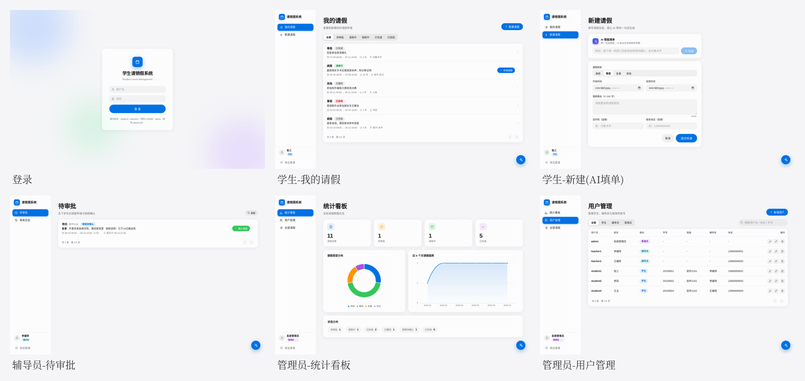
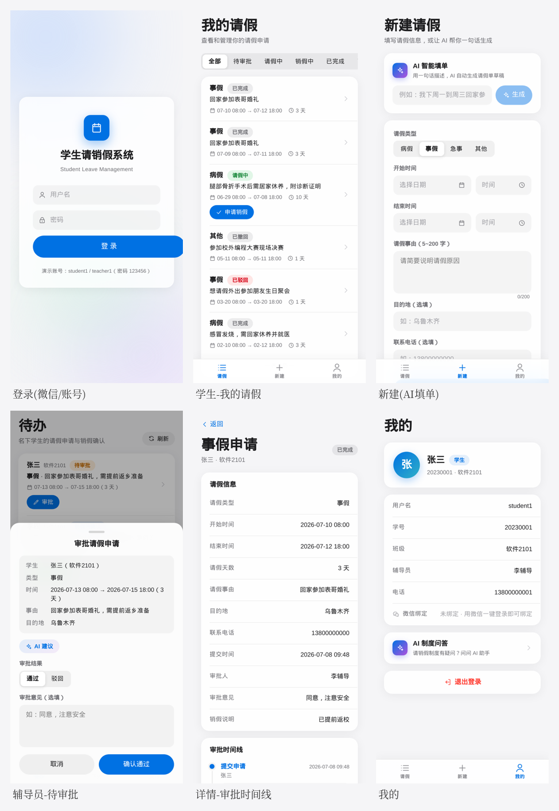

# 学生请销假系统 · 原型设计

> 高保真原型（已实现）。设计语言：Apple HIG（Human Interface Guidelines）风格——CSS 设计令牌、毛玻璃卡片、iOS 风胶囊按钮/状态徽章/分段控件、内联 SVG 图标（无第三方 UI 库、无 emoji）。
> 双端：**Web 管理端**（学生/辅导员/管理员）+ **微信小程序**（uni-app，学生/辅导员移动场景）。

## 1. 设计规范（Design Token）

| 令牌 | 值 | 用途 |
|---|---|---|
| `--accent` | #0071e3 | 主色（Apple 蓝），主按钮/选中态 |
| `--bg` | #f5f5f7 | 页面背景（Apple 浅灰） |
| `--surface` | rgba(255,255,255,.72) | 毛玻璃卡片 |
| 状态色 | 待审批橙 / 请假中绿 #34c759 / 驳回红 #ff3b30 / 完成灰 | iOS 风状态徽章 pill |
| 圆角 | 卡片 18 / 控件 12 / 胶囊 980 | — |

## 2. Web 端原型（6 页）



| 页面 | 角色 | 要点 |
|---|---|---|
| 登录页 | 公共 | 居中毛玻璃卡 + 背景光斑，Apple 风 |
| 我的请假 | 学生 | 分段控件按状态筛选 + 状态徽章 + 分页 |
| 新建请假 | 学生 | 表单 + 顶部 **AI 智能填单**（一句话生成草稿） |
| 待审批 | 辅导员 | 待办列表 + 审批弹窗（通过/驳回/意见 + AI 建议） |
| 统计看板 | 管理员 | 数字卡片 + ECharts 类型分布/月度趋势 |
| 用户管理 | 管理员 | 表格 CRUD + 角色分配 + 重置密码 |

## 3. 微信小程序原型（6 页）



| 页面 | 角色 | 要点 |
|---|---|---|
| 登录 | 公共 | 微信一键登录 + 账号密码双通道 |
| 我的请假 | 学生 | 状态筛选 + 下拉刷新 + 状态徽章 |
| 新建(AI填单) | 学生 | 自然语言 → 请假草稿；date/time picker |
| 待审批 | 辅导员 | 底部 SheetModal 审批弹层 + AI 建议 |
| 详情-时间线 | 学生 | 竖向审批时间线 |
| 我的 | 公共 | 用户信息卡 + 微信绑定状态 + 退出 |

## 4. 业务流程原型串联

```
学生[新建请假] → 学生[我的请假:待审批] → 辅导员[待审批:通过] →
学生[我的请假:请假中] → 学生[详情:申请销假] → 辅导员[确认销假] →
学生[我的请假:已完成]
```

六状态在原型中以状态徽章颜色区分（橙→绿→…→灰），详情页时间线还原每一步操作人与时刻。

> 原始单页高清截图见 [`screenshots/`](screenshots/)（Web：`01_login`~`06_admin_users`；小程序：`mp_01`~`mp_06`）。
