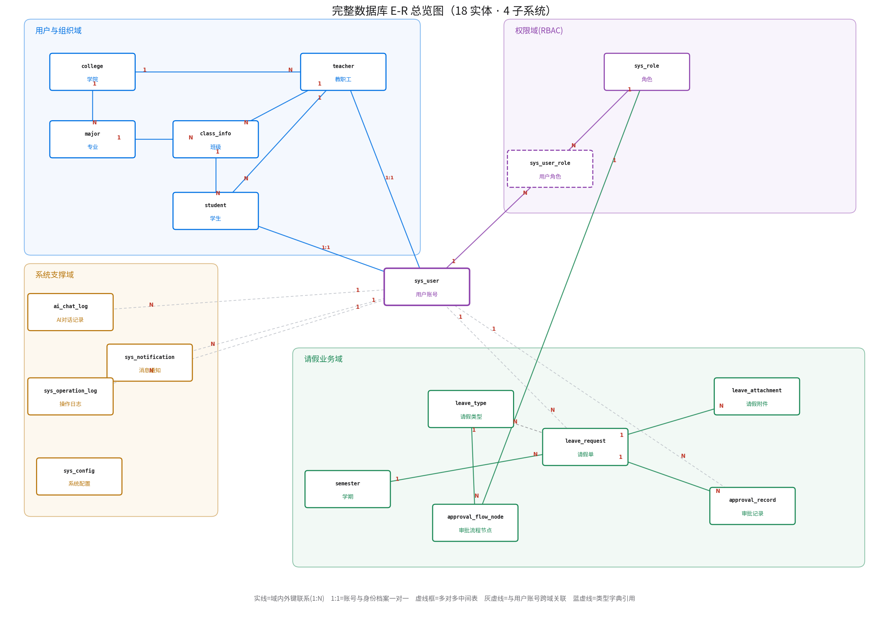

# 学生请销假系统 · 数据库建模说明

> 三级数据建模：**概念模型（E-R）→ 逻辑模型（关系模式）→ 物理模型（DDL）**，抽象程度递减、实现细节递增。
> 数据库共 **18 张表**、分 4 个子系统，做了**完整规范化**（账号与身份档案分离、组织层级、角色多对多）；DDL 见 [`schema.sql`](schema.sql)（已在 MySQL 8 建库 `leave_sys` 实测通过，18 表外键约束全生效）。请假/审批表仍以 `sys_user.id` 为业务主体键，接口契约不变。

## 0. 三级模型的定义与关系

| 层次 | 关注点 | 与 DBMS 关系 | 本项目载体 |
|---|---|---|---|
| **概念模型** | 现实世界有哪些**实体、属性、联系**及基数约束，不涉及表结构 | 无关 | E-R 图（陈氏：矩形=实体、菱形=联系、椭圆=属性；本文用实体+联系+基数总览图） |
| **逻辑模型** | 映射到**关系模型**后的**关系模式、主键、外键、范式** | 无关（已定为关系型） | 关系模式 `关系名(属性…)` + 主外键 |
| **物理模型** | 特定 DBMS 的落地：**数据类型、索引、引擎、字符集、约束** | MySQL 8 / InnoDB | `schema.sql`（DDL） |

---

## 1. 数据库总览（18 表 · 4 子系统）



| 子系统 | 表 | 说明 |
|---|---|---|
| **用户与组织(6)** | sys_user 账号、student 学生、teacher 教职工、college 学院、major 专业、class_info 班级 | 账号与身份档案分离(消单表继承空值列)；学院→专业→班级层级(消 class_name 传递依赖) |
| **权限 RBAC(2)** | sys_role 角色、sys_user_role 用户角色 | 角色多对多，支持一人多角色 |
| **请假业务(6)** | leave_type 类型字典、semester 学期、leave_request 请假单、approval_flow_node 审批节点、approval_record 审批记录、leave_attachment 附件 | 多级审批可配置化、学期归属、附件、审计流水 |
| **系统支撑(4)** | sys_notification 通知、ai_chat_log AI记录、sys_operation_log 操作日志、sys_config 配置 | 审批通知、AI留痕、操作审计、参数配置 |

每张表都由后端功能真实使用（登录/请假/多级审批/排名/导出/通知/附件/配置/AI）。

---

## 2. 概念模型（E-R）

以 §1 的 E-R 总览图为概念模型：**矩形=实体**、连线上 **1/N=基数**、**1:1=一对一**、**虚线框=多对多中间表**。四个子系统的核心实体与联系：

- **用户与组织**：`college` 1:N `major` 1:N `class_info` 1:N `student`；`teacher` 1:N `student`（辅导员带学生）；**`sys_user` 1:1 `student`/`teacher`**（账号与身份档案一对一）。
- **权限**：`sys_user` 与 `sys_role` 通过 `sys_user_role` 构成**多对多**。
- **请假业务**：`student`(学生账号) 1:N `leave_request`（提交）；`teacher` 1:N `leave_request`（审批）；`leave_request` 1:N `approval_record`/`leave_attachment`；`leave_type` 1:N `approval_flow_node`（多级审批配置）。
- 关键点：请假单向"用户"连出**两条**联系（申请人/审批人），落表为 `student_id` 与 `approver_id` 两个外键。

---

## 3. 逻辑模型（关系模式）

**E-R → 关系模式转换规则**：① 实体转关系、标识符做主键；② 1:N 联系"把 1 端主键放 N 端做外键"；③ **M:N 联系建独立关联表**（本例 `sys_user_role`）；④ 自关联把 1 端主键放 N 端、外键指回本表。

规范化后的代表性关系模式（[PK]主键 [FK]外键 (UK)唯一）：

```
sys_user(id[PK], username(UK), password, wx_openid(UK), status, last_login_time, create_time)   -- 账号
student(id[PK], user_id[FK→sys_user.id](UK), student_no(UK), real_name, gender,
        class_id[FK→class_info.id], counselor_id[FK→teacher.id], enroll_year, phone)             -- 学生档案
teacher(id[PK], user_id[FK→sys_user.id](UK), teacher_no(UK), real_name, title, college_id[FK], phone)
college(id[PK], college_code(UK), college_name)   major(id[PK], college_id[FK], major_code(UK), major_name)
class_info(id[PK], major_id[FK→major.id], class_name, grade, head_teacher_id[FK→teacher.id])
sys_role(id[PK], role_code(UK), role_name)        sys_user_role(id[PK], user_id[FK], role_id[FK])   -- M:N
leave_type(id[PK], type_code(UK), type_name, max_days, need_proof)   semester(id[PK], semester_name, is_current)
leave_request(id[PK], student_id[FK→sys_user.id], type, semester_id[FK], start_time, end_time, days,
              reason, destination, status, approver_id[FK→sys_user.id], approve_*, cancel_*, complete_time, ...)
approval_flow_node(id[PK], leave_type_id[FK], node_order, node_name, approver_role_id[FK→sys_role.id])
approval_record(id[PK], leave_id[FK→leave_request.id], operator_id[FK→sys_user.id], action, comment, create_time)
leave_attachment(id[PK], leave_id[FK→leave_request.id], file_name, file_url, file_size, file_type)
sys_notification / ai_chat_log / sys_operation_log(id[PK], user_id[FK→sys_user.id], ...)   sys_config(id[PK], config_key(UK), config_value)
```

> 关键取舍：`leave_request.student_id`/`approver_id` 与 `approval_record.operator_id` 仍指向 **`sys_user.id`**（业务主体键，数据零迁移）；姓名/班级由 VO 用 JOIN（sys_user→student/teacher→class_info）拼出。完整 18 表 DDL 见 [`schema.sql`](schema.sql)。

---

## 4. 物理模型（PDM · MySQL 8 / InnoDB / utf8mb4）

- **引擎/字符集**：InnoDB（事务+行锁）、utf8mb4_unicode_ci。
- **主键**：BIGINT AUTO_INCREMENT 代理键。
- **类型**：文本 VARCHAR 按业务定长；时间 DATETIME；请假天数 `days` 用 **DECIMAL(4,1)**（半天假 1.5）；状态 VARCHAR(20) 存常量。
- **约束/索引**：18 张表间共 15+ 条 `FOREIGN KEY`；`username`/`wx_openid`/各 `*_code`/`student_no`/`teacher_no` UNIQUE；`idx_student`/`idx_status`/`idx_leave` 等覆盖高频查询。
- 完整 DDL（含表/列注释、种子数据）见 **[`schema.sql`](schema.sql)**，已实测建库成功（18 表，外键约束全生效）。

---

## 5. 规范化（范式）分析

**结论**：18 张表均达 **3NF**（多张达 BCNF）——单列主键、非主属性完全依赖主键、非主属性间无传递依赖、决定因素皆为候选键，无插入/更新/删除异常。

**本设计已实施的规范化拆分**（范式的落地）：

| 规范化动作 | 消除的问题 | 落成的表 |
|---|---|---|
| 账号与身份分离：`sys_user` 只留账号字段，学号/班级/姓名拆到 `student`/`teacher` | 单表继承的**稀疏空值列**（学号/班级对教师、管理员行恒空） | sys_user + student + teacher |
| 组织层级抽取：学院→专业→班级 | `class_name` 的**传递依赖**（学生→班级→专业→学院） | college / major / class_info |
| 角色多对多：`sys_role` + `sys_user_role` | 角色枚举硬编码、无法一人多角色 | sys_role + sys_user_role |
| 枚举字典化 / 一对多外移 | 类型枚举散落；一单多附件/多审批步塞不进主表 | leave_type / leave_attachment / approval_record / approval_flow_node |

> 关键工程取舍：`leave_request`/`approval_record` 仍以 `sys_user.id` 为业务主体键（**数据零迁移**），姓名/班级由 VO 用 JOIN 拼出，规范化拆表的同时**接口契约不变、前端零改动**。

**诚实的可讨论点（设计取舍、非范式违规）**：
- `leave_request.days` 是**派生属性**（由起止时间算出），物化存表是读优化，应用层写入时同步，也可改生成列。
- `approve_*`/`cancel_*` 随 `status` 稀疏为空：状态机稀疏列，`status` 只决定"是否有值"、不函数决定取值，非传递依赖。

---

## 6. 面对老师检查的讲解稿 + 预设问答

### 6.1 开场总述（约 1 分钟）
"老师好，数据库按**三级建模**落下来：**概念模型**（这张 E-R 图，实体+联系+基数）→ **逻辑模型**（关系模式，1:N 把 1 端主键放 N 端做外键、M:N 建关联表）→ **物理模型**（MySQL DDL，类型/索引/引擎/外键）。一共 **18 张表分 4 个子系统**，做了完整规范化：账号与身份档案分离、学院-专业-班级层级、角色多对多，每张表都由功能真实使用、可在库里查到。"

### 6.2 逐图讲解要点
- **概念模型**：四子系统的实体与联系；账号-档案 1:1、角色多对多、请假单两个外键（申请人/审批人）、辅导员带学生。
- **物理模型**：InnoDB+utf8mb4、BIGINT 自增主键、DECIMAL(4,1) 存半天、15+ 外键、多处唯一约束与索引。

### 6.3 规范化现场应答
18 表均达 3NF、多张 BCNF；主动讲**已做的三步规范化**（拆 account/student/teacher 消空值列、抽 college/major/class 消传递依赖、角色多对多）；诚实区分"范式违规 vs 设计取舍"（days 派生、状态机稀疏列非违规）。

### 6.4 预设问答

**Q0：为什么是 18 张表？怎么规范化的？**
第三范式三步真拆分：① 账号 `sys_user` 与身份档案 `student`/`teacher` 分离，消单表继承稀疏空值列；② 抽学院/专业/班级层级，消 `class_name` 传递依赖；③ 角色改 `sys_role`+`sys_user_role` 多对多。加请假业务（类型/学期/审批节点/附件/审计）+ 系统支撑（通知/AI/日志/配置），共 18 张 4 子系统，每张真用。关键：请假/审批仍以 `sys_user.id` 为主体键、VO 用 JOIN 拼名字，拆表同时接口契约不变、前端零改动。

**Q1：账号和学生/教师为什么拆三张表？** 原来一张 `sys_user` 宽表用 `role` 区分三类人，导致学号/班级对教师、管理员行恒为空（稀疏空值列）。按 3NF 拆成账号 `sys_user` + 身份档案 `student`/`teacher`，各存各的属性，语义清晰、无空值列。登录时按角色 JOIN 出对应档案组装 VO。

**Q2：外键约束建了吗？** 新增的组织/角色/字典/通知等表都声明了物理 `FOREIGN KEY`（18 表共 15+ 条）；只有 `leave_request`/`approval_record` 指向 `sys_user` 的业务主体键沿用索引 + 应用层事务保证参照完整性（避免数据迁移、便于造数），这是刻意的工程取舍。

**Q3：days 冗余怎么解释？** 派生字段，为列表高频展示做读优化，应用层写入时同步，也可改生成列/视图消除。

**Q4：status 用字符串还是枚举？** VARCHAR 存常量 + 应用层 Java 枚举约束；不用 MySQL ENUM（加减状态要改表、迁移不灵活）。类型另有 `leave_type` 字典表管理。

**Q5：审批记录为什么单独建表？** 一张请假单的审批是多步时间线（一对多），标准审计流水；主表只留最新审批快照供列表直接展示。多级审批的节点由 `approval_flow_node` 配置。

**Q6：如何保证辅导员只看到自己的学生？** `student.counselor_id → teacher.id`：辅导员查请假时，应用层先按其账号 → teacher → 名下学生，再过滤 `leave_request`，做行级隔离，`idx_student` 保证效率。

**Q7：wx_openid 为什么加唯一约束？** openid 是微信唯一身份，UNIQUE 防一个微信绑多个账号；允许 NULL（教师/管理员可不绑），MySQL 多个 NULL 不冲突唯一约束。

**Q8：多级审批的七状态在表里怎么体现？** 用 `leave_request.status` 单字段承载当前态：`PENDING`(待辅导员)→（长假 days>`leave_type.max_days`）`LEADER_PENDING`(待副书记)→`APPROVED`→`CANCEL_PENDING`→`COMPLETED`，另有 `REJECTED`/`REVOKED` 终态；各 `*_time` 记录到达时刻，合法流转由应用层状态机校验，每步轨迹写 `approval_record`。表存"当前态+快照"，明细表存"全过程"。
