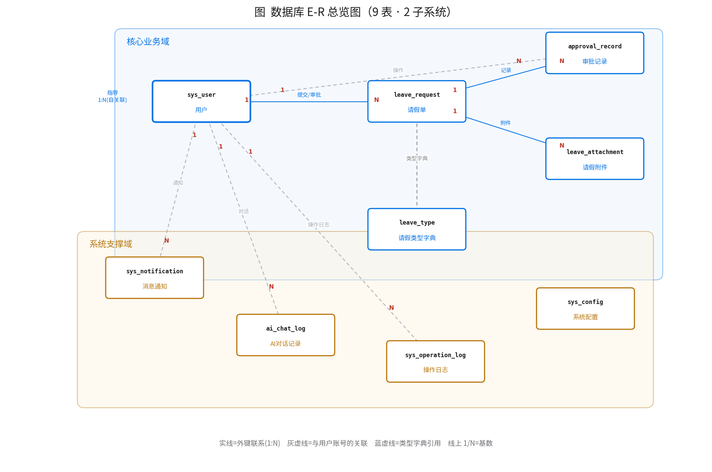
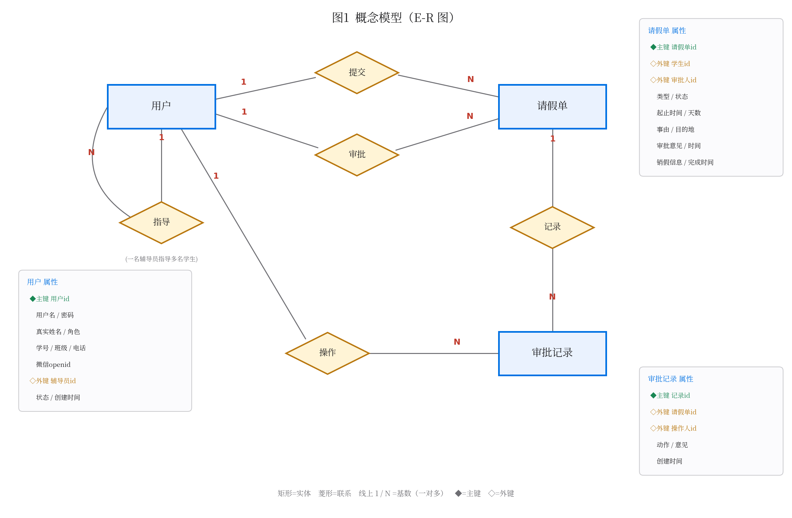
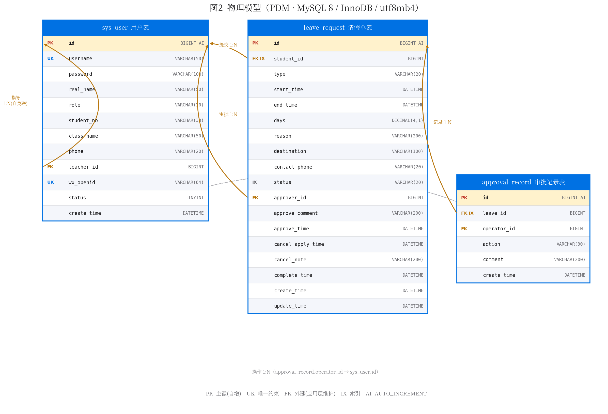

# 学生请销假系统 · 数据库建模说明

> 三级数据建模：**概念模型（E-R）→ 逻辑模型（关系模式）→ 物理模型（DDL）**，抽象程度递减、实现细节递增。
> 数据库共 **9 张表**、分 2 个子系统，**全部由后端代码真实使用**；DDL 见 [`schema.sql`](schema.sql)（已在 MySQL 8 建库 `leave_sys` 实测通过，含索引/外键与种子数据）。设计与实现一致，无"设计了却没用"的表。

## 0. 三级模型的定义与关系

| 层次 | 关注点 | 与 DBMS 关系 | 本项目载体 |
|---|---|---|---|
| **概念模型** | 现实世界有哪些**实体、属性、联系**及基数约束，不涉及表结构 | 无关 | E-R 图（陈氏表示法：矩形=实体、菱形=联系、椭圆=属性） |
| **逻辑模型** | 映射到**关系模型**后的**关系模式、主键、外键、范式** | 无关（已定为关系型） | 关系模式 `关系名(属性…)` + 主外键 |
| **物理模型** | 特定 DBMS 的落地：**数据类型、索引、引擎、字符集、约束** | MySQL 8 / InnoDB | PDM 图 + `schema.sql`（DDL） |

---

## 1. 数据库总览（9 表 · 2 子系统）



按职责分为 2 个子系统，共 9 张表，**每张都由后端功能真实使用**：

| 子系统 | 表 | 说明 |
|---|---|---|
| **核心业务域**(5) | sys_user 用户、leave_request 请假单、approval_record 审批记录、leave_attachment 请假附件、leave_type 请假类型字典 | 请假-审批-销假闭环 + 病假附件 + 类型字典 |
| **系统支撑域**(4) | sys_notification 消息通知、ai_chat_log AI对话记录、sys_operation_log 操作日志、sys_config 系统配置 | 审批结果通知、AI 问答留痕、操作审计、参数配置 |

每张表对应的功能：

| 表 | 由哪个功能使用 |
|---|---|
| sys_user | 登录/鉴权/四角色(学生/辅导员/副书记/管理员) |
| leave_request | 请假提交/撤回/销假/多级审批（七状态状态机） |
| approval_record | 审批时间线（审计流水） |
| leave_attachment | 病假上传诊断证明 + 详情展示 |
| leave_type | 请假类型下拉（`GET /leave-types`）+ 提交时校验 |
| sys_notification | 审批/驳回/销假确认后通知学生 + 未读小红点 |
| ai_chat_log | AI 制度问答留痕 |
| sys_operation_log | 写操作审计日志（拦截器记录） |
| sys_config | AI 供应商/模型 + 请假制度文本可后台配置 |

---

## 2. 概念模型（E-R 图）

### 2.1 核心业务 E-R（陈氏表示法详图）



- **矩形=实体**：用户、请假单、审批记录；**椭圆=属性**（主键加◆、外键加◇）；**菱形=联系**，本系统联系全为 **1:N**。
- 五条联系：**指导**（用户自关联，辅导员 1:N 学生）、**提交**（学生 1:N 请假单）、**审批**（辅导员 1:N 请假单，可空）、**记录**（请假单 1:N 审批记录）、**操作**（用户 1:N 审批记录）。
- 关键点：请假单向"用户"连出**两条**联系（提交/审批），落表即 `student_id` 与 `approver_id` 两个不同外键。

（9 表实体-联系总览见 §1。）

---

## 3. 逻辑模型（关系模式）

**E-R → 关系模式转换规则**：① 每个实体转一张关系、标识符做主键；② 1:N 联系"把 1 端主键放到 N 端做外键"，不单独建联系表；③ M:N 联系建独立关联表（含两端外键）；④ 自关联同样把 1 端主键放 N 端、外键指回本表。

核心 3 表关系模式（下划线/[PK] 主键，[FK] 外键）：

```
sys_user(id[PK], username(UK), password, real_name, role, student_no,
         class_name, phone, teacher_id[FK→sys_user.id], wx_openid(UK), status, create_time)

leave_request(id[PK], student_id[FK→sys_user.id], type, start_time, end_time, days,
              reason, destination, contact_phone, status,
              approver_id[FK→sys_user.id], approve_comment, approve_time,
              cancel_apply_time, cancel_note, complete_time, create_time, update_time)

approval_record(id[PK], leave_id[FK→leave_request.id], operator_id[FK→sys_user.id],
                action, comment, create_time)
```

其余 6 张表的关系模式与外键，一一对应 [`schema.sql`](schema.sql) 的建表语句（每个 `CONSTRAINT fk_*` 即一条外键，如 `ai_chat_log.user_id[FK→sys_user.id]`、`leave_attachment.leave_id[FK→leave_request.id]`）。本系统联系全为 1:N，无多对多，故转换规则③未用到。

---

## 4. 物理模型（PDM · MySQL 8 / InnoDB / utf8mb4）

### 4.1 核心业务表物理模型详图



- **引擎/字符集**：InnoDB（事务+行锁）、utf8mb4_unicode_ci（多语言/emoji）。
- **主键**：BIGINT AUTO_INCREMENT 代理键，与业务解耦。
- **类型选择**：文本 VARCHAR 按业务定长；时间 DATETIME；请假天数 `days` 用 **DECIMAL(4,1)**（支持半天假 1.5）；状态 VARCHAR(20) 存常量。
- **索引/唯一**：`idx_student`、`idx_status`、`idx_leave` 覆盖高频查询；`username`、`wx_openid` UNIQUE。

### 4.2 完整物理模型 DDL

9 张表的完整 DDL（数据类型、主外键、唯一约束、索引、引擎、字符集、种子数据）见 **[`schema.sql`](schema.sql)**，已实测在 MySQL 8 建库成功（`leave_sys`，9 表，新增表外键约束全部生效）。

---

## 5. 规范化（范式）分析

**结论**：核心 3 表在函数依赖意义上均达 **3NF**，其中 `sys_user`、`approval_record` 达 **BCNF**——单列主键、非主属性完全依赖主键（无部分依赖，2NF）、非主属性间无传递依赖（3NF）、决定因素皆为候选键（BCNF），故无插入/更新/删除异常。

**新增 6 张表的设计动因**（都不是堆数量，各有真实职责）：

| 新表 | 动因 | 类型 |
|---|---|---|
| `leave_type` 请假类型字典 | 把散落的 `type` 字符串枚举收敛成**字典表**，可配置最大天数/是否需证明——规范化 | 规范化 |
| `leave_attachment` 请假附件 | 一张请假单可传多个证明文件，**一对多**，塞不进主表——独立实体 | 结构 |
| `sys_notification` 消息通知 | 审批结果异步通知学生，通用能力 | 功能 |
| `ai_chat_log` AI对话记录 | AI 问答留痕，可追溯 | 功能 |
| `sys_operation_log` 操作日志 | 写操作审计，安全合规 | 审计 |
| `sys_config` 系统配置 | AI 供应商/制度文本等参数**可后台配置**，不写死代码 | 支撑 |

> 设计取舍：本系统学生/班级规模小、角色仅 3 种，故**未**引入 RBAC 权限表、组织架构维表（college/major/class）、多级审批流等——这些在大型系统才划算，此处按第三范式的"风险与成本匹配"原则保持精简，用 `role` 字段 + `teacher_id` 自关联即可满足。

**诚实的可讨论点（均为设计取舍、非范式违规）**：
- `leave_request.days` 是**派生属性**（由起止时间按半天规则算出），物化存表是列表页读优化；风险是改起止时间需同步 days（应用层保证），也可改用生成列消除。
- `sys_user` 单表继承的空值列：范式抓不到（不是函数依赖异常），是"可空列语义随 role 变化"的模式弱点。
- `approve_*`/`cancel_*` 随 `status` 稀疏为空：状态机稀疏列，`status` 只决定"是否有值"、不函数决定取值，非传递依赖。

落脚点：**风险与成本匹配**——核心表保持精简跑通闭环，新增表补齐类型字典与通用子系统（通知/日志/配置/附件），每张都能讲清"为什么加、给谁用"。

---

## 6. 面对老师检查的讲解稿 + 预设问答

### 6.1 开场总述（约 1 分钟）

"老师好，我们的数据库是按**三级建模**一层层落下来的：先做**概念模型**（这张 E-R 图，只回答现实世界有哪些实体、怎么关联）；再按转换规则映射成**逻辑模型**（关系模式，每个实体一张表、1:N 联系把 1 端主键放 N 端做外键）；最后落到**物理模型**（MySQL 的 DDL，确定类型、索引、引擎、约束）。一共 9 张表分 2 个子系统，**全部由后端代码真实使用**、可在数据库里查到，设计与实现一致。"

### 6.2 逐图讲解要点
- **概念模型**：讲三个/多个实体、联系与 1:N 基数；强调请假单上"提交/审批"两条联系落成两个外键；辅导员是自关联。
- **物理模型**：讲 InnoDB+utf8mb4、BIGINT 自增主键、DECIMAL(4,1) 存半天、VARCHAR 存状态常量、三个业务索引 + 两个唯一约束。

### 6.3 规范化现场应答
核心 3 表达 3NF/BCNF；主动区分"范式违规"与"设计取舍"（days 派生、单表继承空值列、状态机稀疏列均非违规）；新增的 leave_type 字典表就是把 type 枚举按规范化收敛的例子。

### 6.4 预设问答（8+1 个高频追问）

**Q0：为什么是这 9 张表？会不会太少 / 是不是凑数？**
我们的原则是**设计=实现，每张表都被代码真实用到**，不做"设计了却没接进系统"的表。核心闭环 5 张（用户/请假单/审批记录/附件/类型字典）+ 通用支撑 4 张（通知/AI记录/操作日志/配置），一共 9 张。相比无脑拆到二十几张，我们更看重每张表都能演示对应功能、经得起追问。像 RBAC 权限、组织架构维表、多级审批流这些，是大型系统才划算的，本系统规模下按"风险与成本匹配"原则没有引入——这本身就是规范化设计里的取舍判断。

**Q1：为什么三种角色放一张 sys_user？** 公共字段占多数、登录鉴权走统一入口最简，代价是学生专属列对教师/管理员为空——典型单表继承取舍——本系统角色仅 3 种、规模小，用一张表加 role 字段最省事，比拆 student/teacher 子表更划算。

**Q2：为什么核心表没建物理外键、只建索引？** 外键关系在模型里存在、由应用层事务保证参照完整性；不建库级 FK 是工程惯例（高并发写入/分库时锁开销、便于迁移造数），但 FK 列都建了索引。本次新增的 6 张表（ai_chat_log/notification/attachment 等）则声明了物理 FOREIGN KEY 约束，参照完整性更强。

**Q3：days 冗余怎么解释？** 派生字段，为列表高频展示做读优化（空间换时间），应用层写入时同步；也可改生成列/视图消除。

**Q4：status 用字符串还是枚举？** 物理用 VARCHAR 存常量 + 应用层 Java 枚举约束；不用 MySQL ENUM 是因为加减状态要改表、迁移不灵活。请假类型另有 leave_type 字典表统一管理。

**Q5：审批记录为什么单独建表？** 一张请假单的审批是多步时间线（一对多），是标准审计流水表；主表只留最新审批快照供列表直接展示。

**Q6：如何保证辅导员只看到自己的学生？** 靠 teacher_id 自关联：应用层先按辅导员圈出名下学生 id，再过滤请假单，做行级数据隔离，idx_student 保证效率。

**Q7：wx_openid 为什么加唯一约束？** openid 是微信唯一身份，UNIQUE 防一个微信绑多个账号；允许 NULL（教师/管理员可不绑），MySQL 多个 NULL 不冲突唯一约束。

**Q8：多级审批的七状态状态机在表里怎么体现？** 用 leave_request.status 单字段承载当前态：PENDING(待辅导员)→（长假）LEADER_PENDING(待副书记)→APPROVED→CANCEL_PENDING→COMPLETED，另有 REJECTED/REVOKED 终态；辅导员通过时按 `leave_type.max_days` 判断是否转副书记二级审批。各 *_time 字段记录到达时刻，合法流转由应用层状态机校验，每步完整轨迹写 approval_record。表存"当前态+快照"，明细表存"全过程"。
