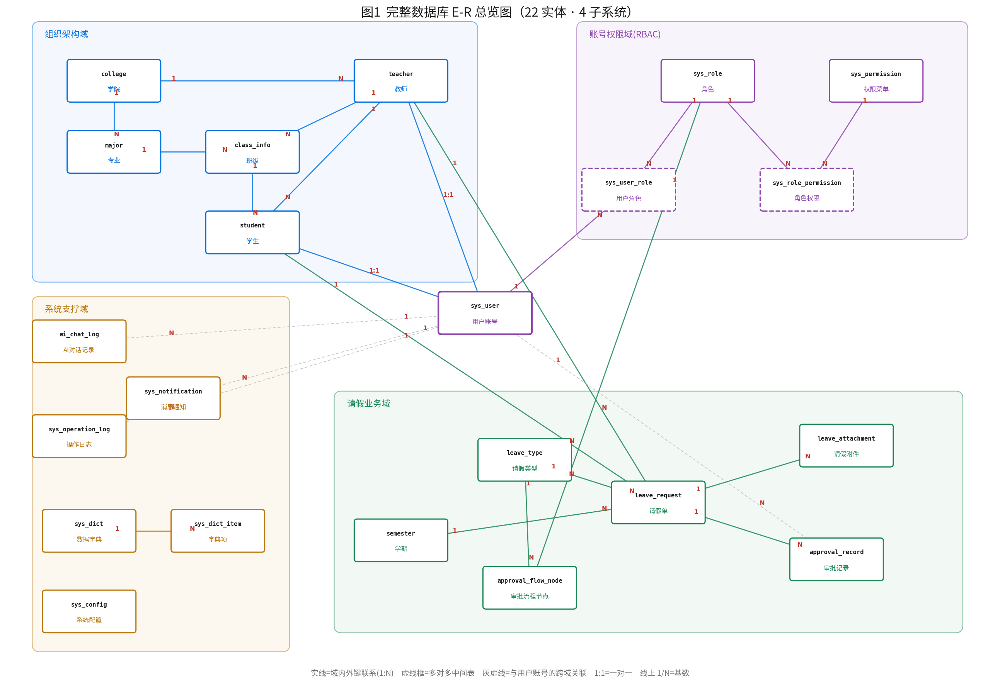

# 学生请销假系统 · 数据库建模说明

> 三级数据建模：**概念模型（E-R）→ 逻辑模型（关系模式）→ 物理模型（DDL）**，抽象程度递减、实现细节递增。
> 完整设计共 **22 张表**、分 4 个子系统；DDL 见 [`schema_full.sql`](schema_full.sql)（已在 MySQL 8 建库 `leave_sys_full` 实测通过，含外键约束与种子数据）。当前迭代已在 `leave_sys` 落地核心闭环 3 表（见 [`schema.sql`](schema.sql)）。

## 0. 三级模型的定义与关系

| 层次 | 关注点 | 与 DBMS 关系 | 本项目载体 |
|---|---|---|---|
| **概念模型** | 现实世界有哪些**实体、属性、联系**及基数约束，不涉及表结构 | 无关 | E-R 图（陈氏表示法：矩形=实体、菱形=联系、椭圆=属性） |
| **逻辑模型** | 映射到**关系模型**后的**关系模式、主键、外键、范式** | 无关（已定为关系型） | 关系模式 `关系名(属性…)` + 主外键 |
| **物理模型** | 特定 DBMS 的落地：**数据类型、索引、引擎、字符集、约束** | MySQL 8 / InnoDB | PDM 图 + `schema_full.sql`（DDL） |

---

## 1. 完整数据库设计总览（22 表 · 4 子系统）



设计按职责划分为 4 个子系统，逐层建模、规范化拆分：

| 子系统 | 表 | 说明 |
|---|---|---|
| **组织架构域**(6) | college 学院、major 专业、class_info 班级、teacher 教师、student 学生、sys_user 用户账号 | 学院→专业→班级→学生的层级；账号与身份分离 |
| **账号权限域 RBAC**(4) | sys_role 角色、sys_permission 权限菜单、sys_user_role 用户角色、sys_role_permission 角色权限 | 用户↔角色、角色↔权限两组多对多 |
| **请假业务域**(6) | leave_type 请假类型、semester 学期、leave_request 请假单、leave_attachment 请假附件、approval_record 审批记录、approval_flow_node 审批流程节点 | 请假核心闭环 + 类型/学期字典 + 附件 + 多级审批配置 |
| **系统支撑域**(6) | sys_notification 消息通知、sys_dict 数据字典、sys_dict_item 字典项、sys_config 系统配置、ai_chat_log AI对话记录、sys_operation_log 操作日志 | 通用支撑：通知、字典、配置、AI 记录、审计日志 |

> **为什么从 3 张核心表扩展到 22 张？** 见 §5 规范化分析——这不是堆表，而是①按第三范式把宽表拆开（消除单表继承的稀疏空值列、消除班级的传递依赖），②补齐一个完整系统本应有的通用子系统（RBAC 权限、数据字典、附件、通知、审计日志）。

---

## 2. 概念模型（E-R 图）

### 2.1 核心业务 E-R（陈氏表示法详图）


- **矩形=实体**：用户、请假单、审批记录；**椭圆=属性**（主键加◆、外键加◇）；**菱形=联系**，本系统联系全为 **1:N**。
- 五条联系：**指导**（用户自关联，辅导员 1:N 学生）、**提交**（学生 1:N 请假单）、**审批**（辅导员 1:N 请假单，可空）、**记录**（请假单 1:N 审批记录）、**操作**（用户 1:N 审批记录）。
- 关键点：请假单向"用户"连出**两条**联系（提交/审批），落表即 `student_id` 与 `approver_id` 两个不同外键。

（完整 22 表的实体-联系见 §1 总览图。）

---

## 3. 逻辑模型（关系模式）

**E-R → 关系模式转换规则**：① 每个实体转一张关系、标识符做主键；② 1:N 联系"把 1 端主键放到 N 端做外键"，不单独建联系表；③ M:N 联系建独立关联表（含两端外键）；④ 自关联同样把 1 端主键放 N 端、外键指回本表。

核心 3 表关系模式（下划线/[PK] 主键，[FK] 外键）：

```
sys_user(id[PK], username(UK), password, real_name, role, student_no,
         class_name, phone, teacher_id[FK→sys_user.id], wx_openid(UK), status, create_time)

leave_request(id[PK], student_id[FK→sys_user.id], type, start_time, end_time, days,
              reason, destination, contact_phone, status,
              approver_id[FK→sys_user.id], approve_comment, approve_time,
              cancel_apply_time, cancel_note, complete_time, create_time, update_time)

approval_record(id[PK], leave_id[FK→leave_request.id], operator_id[FK→sys_user.id],
                action, comment, create_time)
```

完整 22 表的关系模式与外键，一一对应 [`schema_full.sql`](schema_full.sql) 的建表语句（每个 `CONSTRAINT fk_*` 即一条外键）。M:N 的两张关联表 `sys_user_role(user_id[FK], role_id[FK])`、`sys_role_permission(role_id[FK], permission_id[FK])` 即转换规则③的产物。

---

## 4. 物理模型（PDM · MySQL 8 / InnoDB / utf8mb4）

### 4.1 核心业务表物理模型详图


- **引擎/字符集**：InnoDB（事务+行锁）、utf8mb4_unicode_ci（多语言/emoji）。
- **主键**：BIGINT AUTO_INCREMENT 代理键，与业务解耦。
- **类型选择**：文本 VARCHAR 按业务定长；时间 DATETIME；请假天数 `days` 用 **DECIMAL(4,1)**（支持半天假 1.5）；状态 VARCHAR(20) 存常量。
- **索引/唯一**：`idx_student`、`idx_status`、`idx_leave` 覆盖高频查询；`username`、`wx_openid` UNIQUE。

### 4.2 完整物理模型 DDL

22 张表的完整 DDL（数据类型、主外键、唯一约束、索引、引擎、字符集、表/列注释、种子数据）见 **[`schema_full.sql`](schema_full.sql)**，已实测在 MySQL 8 建库成功（`leave_sys_full`，22 表，外键约束全部生效）。

---

## 5. 规范化（范式）分析

**结论**：核心 3 表在函数依赖意义上均达 **3NF**，其中 `sys_user`、`approval_record` 达 **BCNF**——单列主键、非主属性完全依赖主键（无部分依赖，2NF）、非主属性间无传递依赖（3NF）、决定因素皆为候选键（BCNF），故无插入/更新/删除异常。

**扩展设计（22 表）正是规范化的落地**：

| 规范化动作 | 消除的问题 | 对应新表 |
|---|---|---|
| `sys_user` 宽表 → 拆 `student` / `teacher` 子表 | 单表继承的**稀疏空值列**（学号/班级对教师行恒空） | student、teacher |
| 抽取班级维度 → `college / major / class_info` | 一旦班级成独立实体，`class_name` 存在**传递依赖**（学生→班级→专业→学院），拆维表消除 | college、major、class_info |
| `type`/`status` 字符串枚举 → 字典表 | 枚举散落、无法配置 | leave_type、sys_dict / sys_dict_item |
| 角色权限从代码硬编码 → RBAC 表 | 权限不可维护 | sys_role、sys_permission、两张关联表 |

**诚实的可讨论点（均为设计取舍、非范式违规）**：
- `leave_request.days` 是**派生属性**（由起止时间按半天规则算出），物化存表是列表页读优化；风险是改起止时间需同步 days（应用层保证），也可改用生成列消除。
- `sys_user` 单表继承的空值列：范式抓不到（不是函数依赖异常），是"可空列语义随 role 变化"的模式弱点。
- `approve_*`/`cancel_*` 随 `status` 稀疏为空：状态机稀疏列，`status` 只决定"是否有值"、不函数决定取值，非传递依赖。

落脚点：**风险与成本匹配**——核心表保持精简跑通闭环，完整设计做规范化拆分与子系统补齐，两者都能讲清"为什么这么设计"。

---

## 6. 面对老师检查的讲解稿 + 预设问答

### 6.1 开场总述（约 1 分钟）

"老师好，我们的数据库是按**三级建模**一层层落下来的：先做**概念模型**（这张 E-R 图，只回答现实世界有哪些实体、怎么关联）；再按转换规则映射成**逻辑模型**（关系模式，每个实体一张表、1:N 联系把 1 端主键放 N 端做外键）；最后落到**物理模型**（MySQL 的 DDL，确定类型、索引、引擎、约束）。完整设计 22 张表分 4 个子系统，当前迭代先把核心请假闭环 3 张表跑通，其余已按第三范式拆分建表、可在数据库里查到。"

### 6.2 逐图讲解要点
- **概念模型**：讲三个/多个实体、联系与 1:N 基数；强调请假单上"提交/审批"两条联系落成两个外键；辅导员是自关联。
- **物理模型**：讲 InnoDB+utf8mb4、BIGINT 自增主键、DECIMAL(4,1) 存半天、VARCHAR 存状态常量、三个业务索引 + 两个唯一约束。

### 6.3 规范化现场应答
核心 3 表达 3NF/BCNF；主动区分"范式违规"与"设计取舍"（days 派生、单表继承空值列、状态机稀疏列均非违规）；完整设计的 22 表就是把这些点按 3NF 拆开的结果。

### 6.4 预设问答（8+1 个高频追问）

**Q0：为什么从 3 张表扩到 22 张？是不是凑数？**
不是凑数，是两件真实的事：① 按第三范式规范化——把 sys_user 宽表拆成 student/teacher 子表消除空值列，把班级抽成 college/major/class_info 维表消除传递依赖，把 type/status 枚举做成字典表；② 补齐一个完整系统本该有的通用子系统——RBAC 权限、数据字典、请假附件、消息通知、审计日志、AI 记录。每张表都有真实用途，且分 4 个子系统组织，不是平铺。

**Q1：为什么三种角色放一张 sys_user？** 公共字段占多数、登录鉴权走统一入口最简，代价是学生专属列对教师/管理员为空——典型单表继承取舍；完整设计里已拆出 student/teacher 子表。

**Q2：为什么核心表没建物理外键、只建索引？** 外键关系在模型里存在、由应用层事务保证参照完整性；不建库级 FK 是工程惯例（高并发写入/分库时锁开销、便于迁移造数），但 FK 列都建了索引。完整设计 `schema_full.sql` 里则声明了完整 FOREIGN KEY 约束。

**Q3：days 冗余怎么解释？** 派生字段，为列表高频展示做读优化（空间换时间），应用层写入时同步；也可改生成列/视图消除。

**Q4：status 用字符串还是枚举？** 物理用 VARCHAR 存常量 + 应用层 Java 枚举约束；不用 MySQL ENUM 是因为加减状态要改表、迁移不灵活。完整设计另有 sys_dict/sys_dict_item 字典表统一管理枚举。

**Q5：审批记录为什么单独建表？** 一张请假单的审批是多步时间线（一对多），是标准审计流水表；主表只留最新审批快照供列表直接展示。

**Q6：如何保证辅导员只看到自己的学生？** 靠 teacher_id 自关联（完整设计里是 student.counselor_id）：应用层先按辅导员圈出名下学生 id，再过滤请假单，做行级数据隔离，idx_student 保证效率。

**Q7：wx_openid 为什么加唯一约束？** openid 是微信唯一身份，UNIQUE 防一个微信绑多个账号；允许 NULL（教师/管理员可不绑），MySQL 多个 NULL 不冲突唯一约束。

**Q8：六状态状态机在表里怎么体现？** 用 leave_request.status 单字段承载当前态 + 各 *_time 字段记录到达时刻；合法流转由应用层状态机校验；每次流转的完整轨迹写 approval_record。表存"当前态+快照"，明细表存"全过程"。
